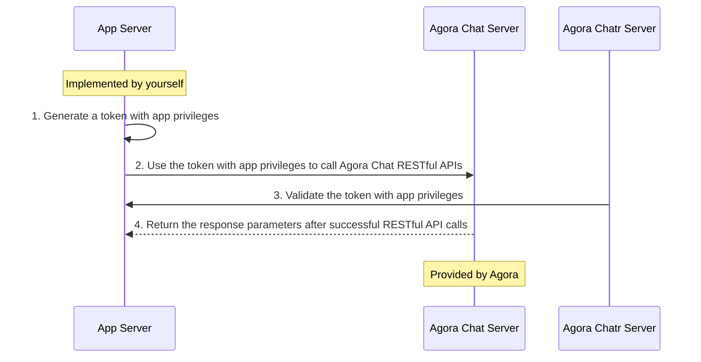

# Sequence Diagram

```mermaid
sequenceDiagram
    %% Group Declarations
    rect rgb(255, 255, 255)
    note over App Server: Implemented by yourself
    %% Interaction Steps
    App Server->>App Server: 1. Generate a token with app privileges
    App Server->>Agora Chat Server: 2. Use the token with app privileges to call Agora Chat RESTful APIs
    Agora Chatr Server->>App Server: 3. Validate the token with app privileges
    Agora Chat Server-->>App Server: 4. Return the response parameters after successful RESTful API calls
    end
    rect rgb(255, 255, 255)
    note over Agora Chat Server: Provided by Agora
    end
```
