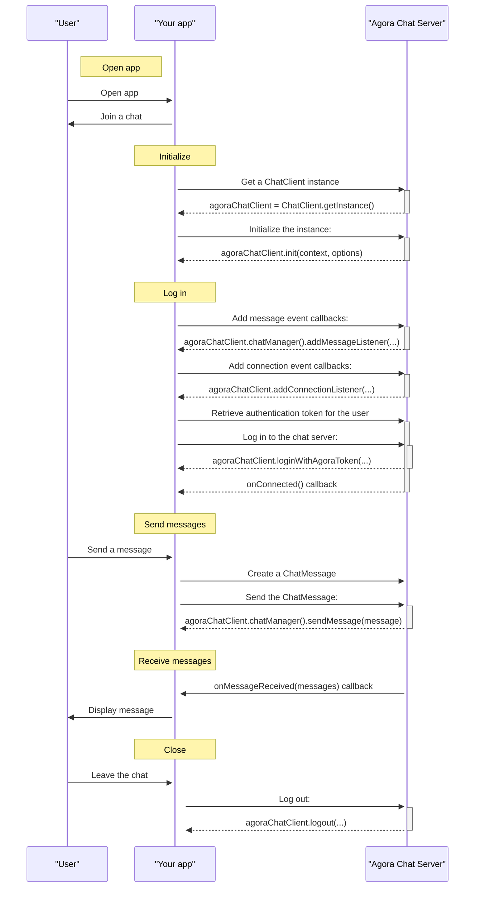

# Sequence Diagram

```mermaid
sequenceDiagram
    participant User as "User"
    participant ChatSDK as "Your app"
    participant Agora as "Agora Chat Server"

    rect rgb(255, 255, 255)
        note right of User: Open app
        User ->>+ ChatSDK: Open app
        ChatSDK ->> User: Join a chat
    end

    rect rgb(255, 255, 255)
        note over ChatSDK: Initialize
        ChatSDK ->>+ Agora: Get a ChatClient instance
        Agora -->>- ChatSDK: agoraChatClient = ChatClient.getInstance()
        ChatSDK ->>+ Agora: Initialize the instance:
        Agora -->>- ChatSDK: agoraChatClient.init(context, options)
    end

    rect rgb(255, 255, 255)
        note over ChatSDK: Log in
        ChatSDK ->>+ Agora: Add message event callbacks:
        Agora -->>- ChatSDK: agoraChatClient.chatManager().addMessageListener(...)
        ChatSDK ->>+ Agora: Add connection event callbacks:
        Agora -->>- ChatSDK: agoraChatClient.addConnectionListener(...)
        ChatSDK ->>+ Agora: Retrieve authentication token for the user
        ChatSDK ->>+ Agora: Log in to the chat server:
        Agora -->>- ChatSDK: agoraChatClient.loginWithAgoraToken(...)
        Agora -->>- ChatSDK: onConnected() callback
    end

    rect rgb(255, 255, 255)
        note over ChatSDK: Send messages
        User ->>+ ChatSDK: Send a message
        ChatSDK ->>+ Agora: Create a ChatMessage
        ChatSDK ->>+ Agora: Send the ChatMessage:
        Agora -->>- ChatSDK: agoraChatClient.chatManager().sendMessage(message)
    end

    rect rgb(255, 255, 255)
        note over ChatSDK: Receive messages
        Agora ->>+ ChatSDK: onMessageReceived(messages) callback
        ChatSDK ->> User: Display message
    end

    rect rgb(255, 255, 255)
        note over ChatSDK: Close
        User ->>+ ChatSDK: Leave the chat
        ChatSDK ->>+ Agora: Log out:
        Agora -->>- ChatSDK: agoraChatClient.logout(...)
    end
```
