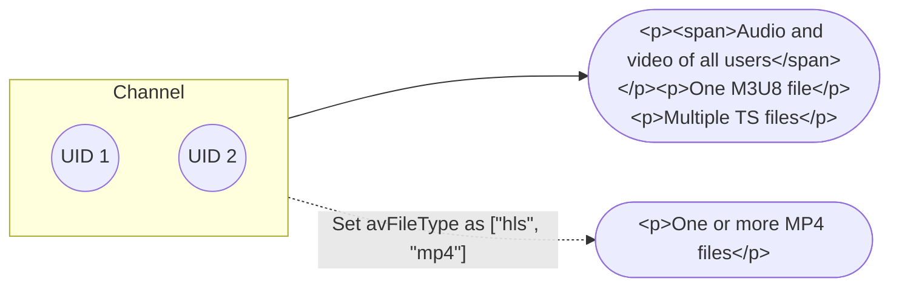

# Flow Diagram

```mermaid
flowchart LR
    subgraph channel ["Channel"]
        uid1((UID 1))
        uid2((UID 2))
    end
    
    media_desc_box(["&lt;p&gt;&lt;span&gt;Audio and video of all users&lt;/span&gt;&lt;/p&gt;&lt;p&gt;One M3U8 file&lt;/p&gt;&lt;p&gt;Multiple TS files&lt;/p&gt;"])
    config_box(["&lt;p&gt;One or more MP4 files&lt;/p&gt;"])
    
    channel --> media_desc_box
    channel -.-> |"Set avFileType as [&quot;hls&quot;, &quot;mp4&quot;]"| config_box
```
