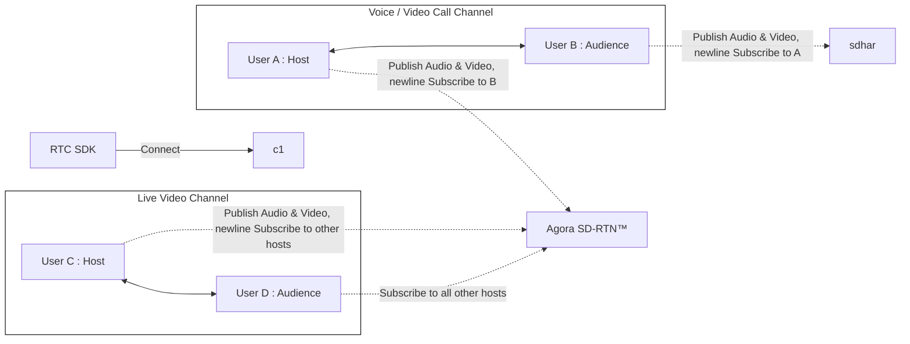

# Flow Diagram

```mermaid
flowchart LR
  sdk[RTC SDK] -->|Connect| c1

  subgraph vg ["Voice / Video Call Channel"]
      ua[User A : Host]
      ub[User B : Audience]
      ua <--> ub
  end

  subgraph vl ["Live Video Channel"]
      uc[User C : Host]
      ud[User D : Audience]
      uc <--> ud
  end

  sdrt["Agora SD-RTN&trade;"]

  ua -.->|Publish Audio & Video, newline Subscribe to B| sdrt
  ub -.->|Publish Audio & Video, newline Subscribe to A| sdhar
  uc -.->|Publish Audio & Video, newline Subscribe to other hosts| sdrt
  ud -.->|Subscribe to all other hosts| sdrt

  style vg fill:white,stroke:black
  style vl fill:white,stroke:black
```
