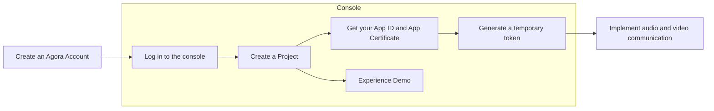

# Flow Diagram

```mermaid
flowchart LR
    createAccount["Create an Agora Account"] --> loginConsole["Log in to the console"]
    subgraph console ["Console"]
        loginConsole --> createProject["Create a Project"]
        createProject --> getAppID["Get your App ID and App Certificate"]
        createProject --> experienceDemo["Experience Demo"]
        getAppID --> generateToken["Generate a temporary token"]
    end
    generateToken --> implementAV["Implement audio and video communication"]
```
