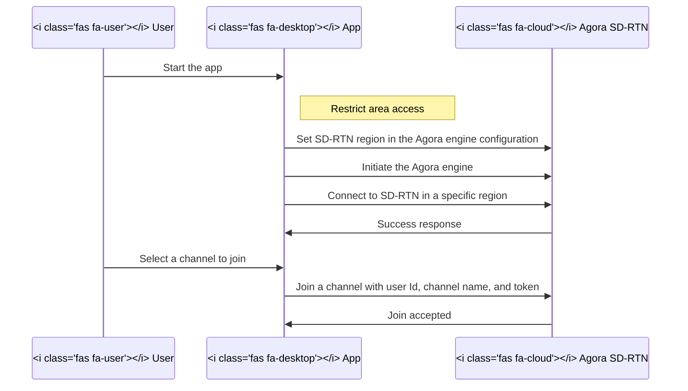

# Flow Diagram

```mermaid
sequenceDiagram
  participant User as <i class="fas fa-user"></i> User
  participant App as <i class="fas fa-desktop"></i> App
  participant Agora as <i class="fas fa-cloud"></i> Agora SD-RTN
  User->>App: Start the app
  rect rgb(255, 255, 255)
    note right of App: Restrict area access
    App->>Agora: Set SD-RTN region in the Agora engine configuration
    App->>Agora: Initiate the Agora engine
    App->>Agora: Connect to SD-RTN in a specific region
    Agora->>App: Success response
  end
  User->>App: Select a channel to join
  App->>Agora: Join a channel with user Id, channel name, and token
  Agora->>App: Join accepted
```
