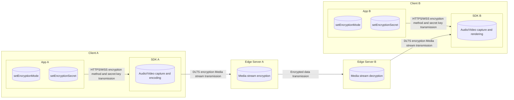

# Flow Diagram

```mermaid
flowchart LR
  subgraph ClientA["Client A"]
    subgraph AppA["App A"]
      setEncryptionModeA[("setEncryptionMode")]
      setEncryptionSecretA[("setEncryptionSecret")]
    end
    subgraph SDKA["SDK A"]
      AVcaptureA[("Audio/Video capture and encoding")]
    end

    AppA -->|HTTPS/WSS encryption method and secret key transmission| SDKA
  end
  
  subgraph ClientB["Client B"]
    subgraph AppB["App B"]
      setEncryptionModeB[("setEncryptionMode")]
      setEncryptionSecretB[("setEncryptionSecret")]
    end
    subgraph SDKB["SDK B"]
      AVrenderB[("Audio/Video capture and rendering")]
    end

    AppB -->|HTTPS/WSS encryption method and secret key transmission| SDKB
  end

  subgraph EdgeServerA["Edge Server A"]
    encryption[("Media stream encryption")]
  end

  subgraph EdgeServerB["Edge Server B"]
    decryption[("Media stream decryption")]
  end

  SDKA -->|DLTS encryption Media stream transmission| EdgeServerA
  EdgeServerA -->|Encrypted data transmission| EdgeServerB
  EdgeServerB -->|DLTS encryption Media stream transmission| SDKB
```
