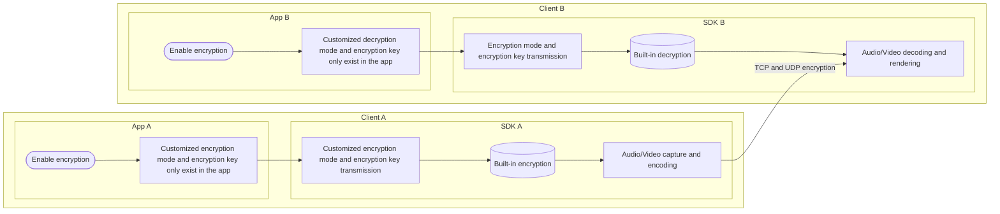

# Flow Diagram

```mermaid
flowchart LR
    subgraph ClientA["Client A"]
        direction LR
        subgraph AppA["App A"]
            EnableEncryptionA([Enable encryption])
            CustomEncryptionAppA[Customized encryption mode and encryption key only exist in the app]
        end
        subgraph SDKA["SDK A"]
            CustomEncryptionSDKA[Customized encryption mode and encryption key transmission]
            BuiltInEncSDKA[(Built-in encryption)]
            AVCaptureEncodeSDKA[Audio/Video capture and encoding]
        end
        EnableEncryptionA --> CustomEncryptionAppA
        CustomEncryptionAppA --> CustomEncryptionSDKA
        CustomEncryptionSDKA --> BuiltInEncSDKA
        BuiltInEncSDKA --> AVCaptureEncodeSDKA
    end
    
    subgraph ClientB["Client B"]
        direction LR
        subgraph AppB["App B"]
            EnableEncryptionB([Enable encryption])
            CustomDecryptionAppB[Customized decryption mode and encryption key only exist in the app]
        end
        subgraph SDKB["SDK B"]
            CustomDecryptionSDKB[Encryption mode and encryption key transmission]
            BuiltInDecSDKB[(Built-in decryption)]
            AVDecodeRenderSDKB[Audio/Video decoding and rendering]
        end
        EnableEncryptionB --> CustomDecryptionAppB
        CustomDecryptionAppB --> CustomDecryptionSDKB
        CustomDecryptionSDKB --> BuiltInDecSDKB
        BuiltInDecSDKB --> AVDecodeRenderSDKB
    end
    
    AVCaptureEncodeSDKA -->|TCP and UDP encryption| AVDecodeRenderSDKB
```
