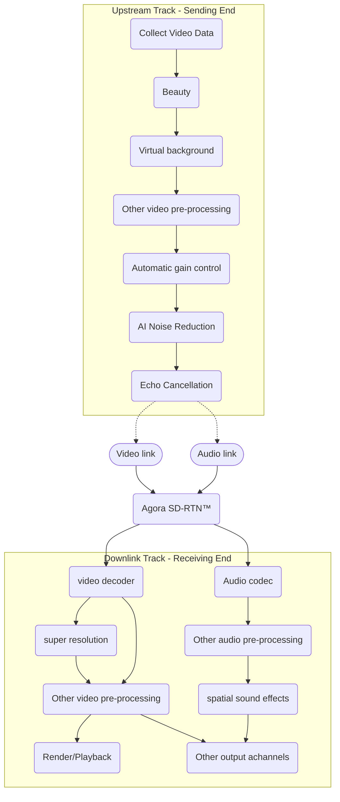

# Flow Diagram

```mermaid
flowchart TD
    subgraph Upstream ["Upstream Track - Sending End"]
        direction TB
        CollectVideoData("Collect Video Data")
        Beauty("Beauty")
        VirtualBackground("Virtual background")
        OtherVideoPreprocessing("Other video pre-processing")
        AGC("Automatic gain control")
        AINR("AI Noise Reduction")
        EchoCancellation("Echo Cancellation")

        CollectVideoData --> Beauty --> VirtualBackground --> OtherVideoPreprocessing --> AGC --> AINR --> EchoCancellation
    end

    subgraph Downlink ["Downlink Track - Receiving End"]
        direction TB
        VideoDecoder("video decoder")
        AudioCodec("Audio codec")
        SuperResolution("super resolution")
        OtherVideoPreprocessingR("Other video pre-processing")
        OtherAudioPreprocessing("Other audio pre-processing")
        SpatialSoundEffects("spatial sound effects")
        RenderPlayback("Render/Playback")
        OtherOutputChannels("Other output achannels")

        VideoDecoder --> SuperResolution --> OtherVideoPreprocessingR --> RenderPlayback
        VideoDecoder --> OtherVideoPreprocessingR
        AudioCodec --> OtherAudioPreprocessing --> SpatialSoundEffects --> OtherOutputChannels
        OtherVideoPreprocessingR --> OtherOutputChannels
    end

    AgoraSDRTN("Agora SD-RTN™")

    EchoCancellation -.-> VideoLink(["Video link"])
    EchoCancellation -.-> AudioLink(["Audio link"])
    VideoLink --> AgoraSDRTN
    AudioLink --> AgoraSDRTN
    AgoraSDRTN --> VideoDecoder
    AgoraSDRTN --> AudioCodec
```
