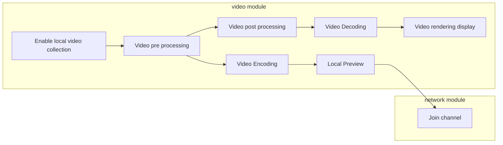

# Flow Diagram

```mermaid
flowchart LR
    subgraph video_module ["video module"]
        Enable_local_video_collection["Enable local video collection"]
        Video_pre_processing["Video pre processing"]
        Video_Encoding["Video Encoding"]
        Local_Preview["Local Preview"]
        Video_post_processing["Video post processing"]
        Video_Decoding["Video Decoding"]
        Video_rendering_display["Video rendering display"]

        Enable_local_video_collection --> Video_pre_processing
        Video_pre_processing --> Video_Encoding
        Video_pre_processing --> Video_post_processing
        Video_Encoding --> Local_Preview
        Video_post_processing --> Video_Decoding
        Video_Decoding --> Video_rendering_display
    end
    
    subgraph network_module ["network module"]
        Join_channel["Join channel"]
        
        Local_Preview --> Join_channel
    end
```
