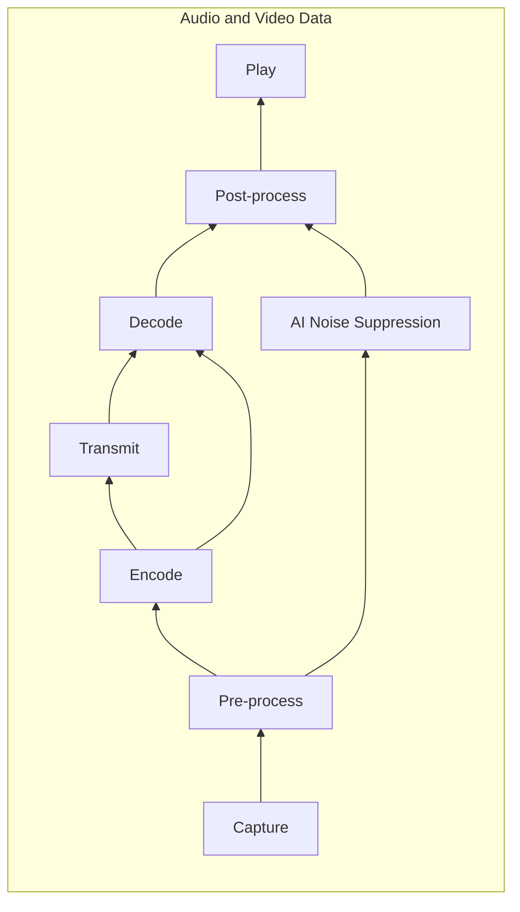

# Flow Diagram

```mermaid
flowchart LR
    subgraph Audio_and_video_data["Audio and Video Data"]
        direction LR;
        Capture --> Pre-process --> Encode --> Transmit --> Decode --> Post-process --> Play

        direction TB;
        Encode --> Decode

        direction BT;
        Pre-process --> AI_Noise_suppression["AI Noise Suppression"] --> Post-process
    end
```
