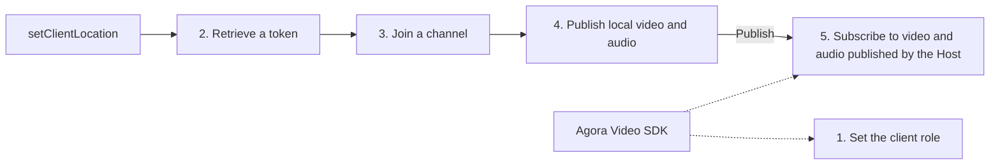

# Sequence Diagram

```mermaid
flowchart LR
    setClientRole[1. Set the client role]
    retrieveToken[2. Retrieve a token]
    joinChannel[3. Join a channel]
    publishVideoAudio[4. Publish local video and audio]

    subscribeVideoAudio[5. Subscribe to video and audio published by the Host]

    sdk[Agora Video SDK] -.-> setClientRole
    sdk -.-> subscribeVideoAudio
    setClientLocation --> retrieveToken --> joinChannel --> publishVideoAudio
    publishVideoAudio -->|Publish| subscribeVideoAudio
```
