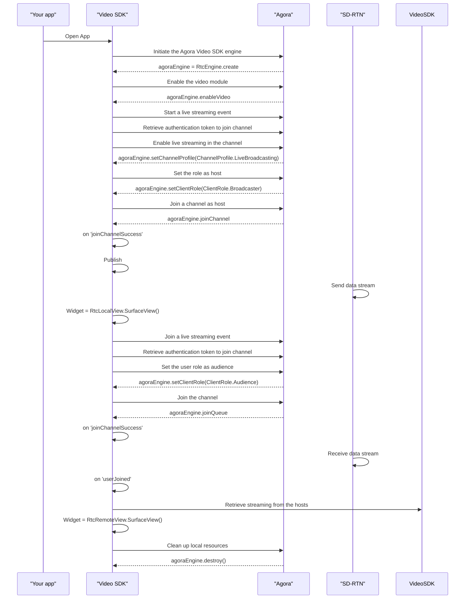

# Sequence Diagram

```mermaid
sequenceDiagram
    participant Your_app as "Your app"
    participant Video_SDK as "Video SDK"
    participant Agora as "Agora"
    participant SD_RTN as "SD-RTN"

    Your_app->>Video_SDK: Open App
    Video_SDK->>Agora: Initiate the Agora Video SDK engine
    Agora-->>Video_SDK: agoraEngine = RtcEngine.create

    Video_SDK->>Agora: Enable the video module
    Agora-->>Video_SDK: agoraEngine.enableVideo

    Video_SDK->>Agora: Start a live streaming event
    Video_SDK->>Agora: Retrieve authentication token to join channel
    Video_SDK->>Agora: Enable live streaming in the channel
    Agora-->>Video_SDK: agoraEngine.setChannelProfile(ChannelProfile.LiveBroadcasting)
    Video_SDK->>Agora: Set the role as host
    Agora-->>Video_SDK: agoraEngine.setClientRole(ClientRole.Broadcaster)
    Video_SDK->>Agora: Join a channel as host
    Agora-->>Video_SDK: agoraEngine.joinChannel
    Video_SDK->>Video_SDK: on 'joinChannelSuccess'
    Video_SDK->>Video_SDK: Publish
    SD_RTN->>SD_RTN: Send data stream
    Video_SDK->>Video_SDK: Widget = RtcLocalView.SurfaceView()

    Video_SDK->>Agora: Join a live streaming event
    Video_SDK->>Agora: Retrieve authentication token to join channel
    Video_SDK->>Agora: Set the user role as audience
    Agora-->>Video_SDK: agoraEngine.setClientRole(ClientRole.Audience)
    Video_SDK->>Agora: Join the channel
    Agora-->>Video_SDK: agoraEngine.joinQueue
    Video_SDK->>Video_SDK: on 'joinChannelSuccess'
    SD_RTN->>SD_RTN: Receive data stream
    Video_SDK->>Video_SDK: on 'userJoined'
    Video_SDK->>VideoSDK: Retrieve streaming from the hosts
    Video_SDK->>Video_SDK: Widget = RtcRemoteView.SurfaceView()

    Video_SDK->>Agora: Clean up local resources
    Agora-->>Video_SDK: agoraEngine.destroy()
```
