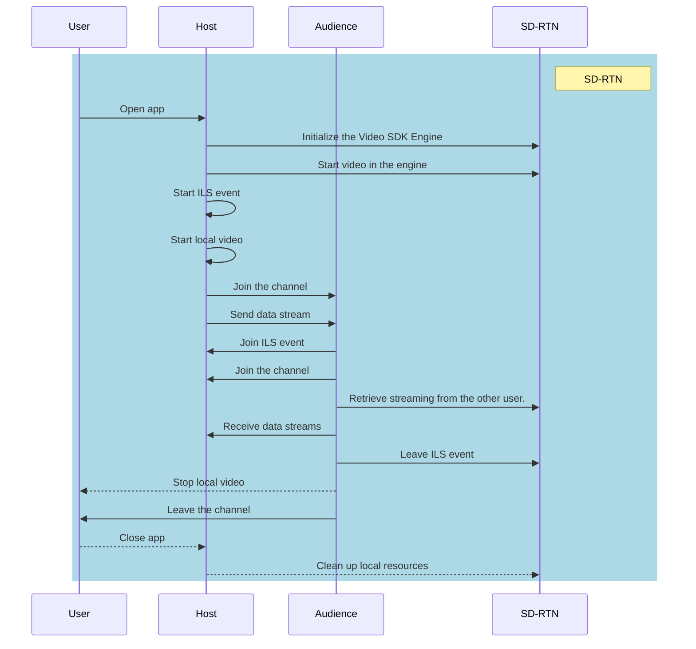

# Sequence Diagram

```mermaid
sequenceDiagram
    participant User
    participant Host
    participant Audience
    participant Agora as SD-RTN

    rect rgb(173, 216, 230)
        note right of Agora: SD-RTN

        User->>Host: Open app
        Host->>Agora: Initialize the Video SDK Engine
        Host->>Agora: Start video in the engine

        Host->>Host: Start ILS event
        Host->>Host: Start local video
        Host->>Audience: Join the channel
        Host->>Audience: Send data stream

        Audience->>Host: Join ILS event
        Audience->>Host: Join the channel
        Audience->>Agora: Retrieve streaming from the other user.
        Audience->>Host: Receive data streams
        Audience->>Agora: Leave ILS event
        Audience-->>User: Stop local video
        Audience->>User: Leave the channel
        User-->>Host: Close app
        Host-->>Agora: Clean up local resources

    end
```
