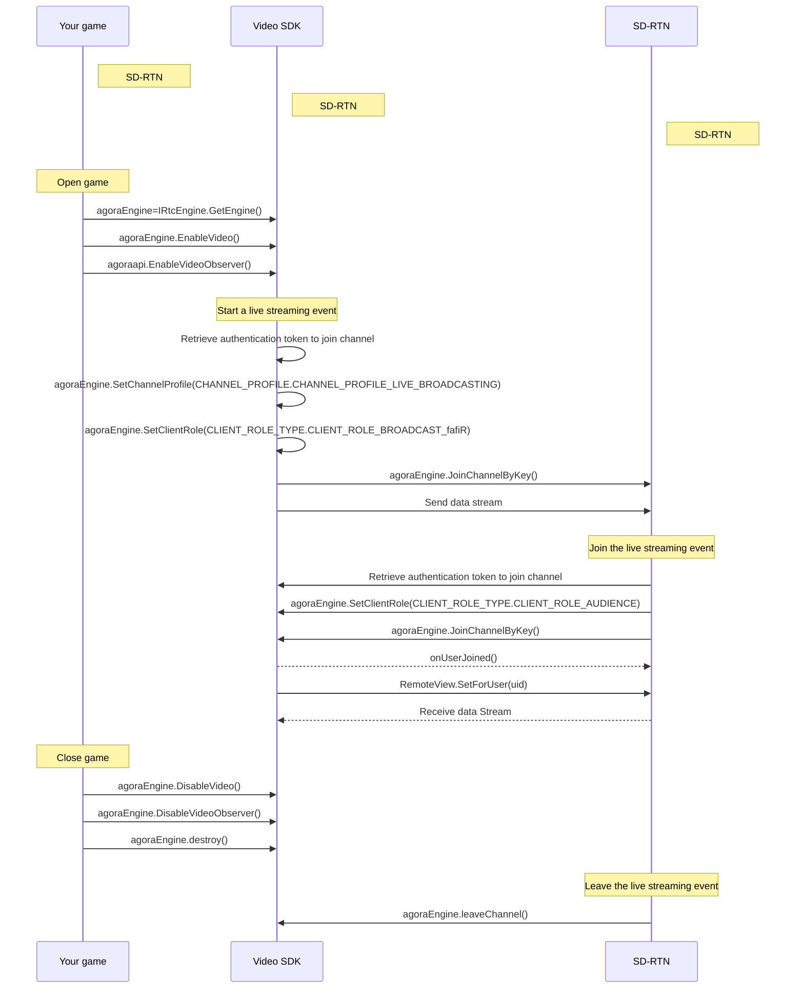

# Sequence Diagram

```mermaid
sequenceDiagram
    participant User as Your game
    participant Host as Video SDK
    participant Audience as SD-RTN

    rect rgb(255,255,255)
    note right of User: SD-RTN
    note right of Host: SD-RTN
    note right of Audience: SD-RTN
    end
    
    %% User Interactions
    rect rgb(255,255,255)
    note over User: Open game
    User ->> Host: agoraEngine=IRtcEngine.GetEngine()
    User ->> Host: agoraEngine.EnableVideo()
    User ->> Host: agoraapi.EnableVideoObserver()
    end

    %% Host Interactions
    rect rgb(255,255,255)
    note over Host: Start a live streaming event
    Host ->> Host: Retrieve authentication token to join channel
    Host ->> Host: agoraEngine.SetChannelProfile(CHANNEL_PROFILE.CHANNEL_PROFILE_LIVE_BROADCASTING)
    Host ->> Host: agoraEngine.SetClientRole(CLIENT_ROLE_TYPE.CLIENT_ROLE_BROADCAST_fafiR)
    Host ->> Audience: agoraEngine.JoinChannelByKey()
    Host ->> Audience: Send data stream
    end

    %% Audience Interactions
    rect rgb(255,255,255)
    note over Audience: Join the live streaming event
    Audience ->> Host: Retrieve authentication token to join channel
    Audience ->> Host: agoraEngine.SetClientRole(CLIENT_ROLE_TYPE.CLIENT_ROLE_AUDIENCE)
    Audience ->> Host: agoraEngine.JoinChannelByKey()
    Host -->> Audience: onUserJoined()
    Host ->> Audience: RemoteView.SetForUser(uid)
    Audience -->> Host: Receive data Stream
    end

    %% User Interactions
    rect rgb(255,255,255)
    note over User: Close game
    User ->> Host: agoraEngine.DisableVideo()
    User ->> Host: agoraEngine.DisableVideoObserver()
    User ->> Host: agoraEngine.destroy()
    end

    %% Audience Exiting
    rect rgb(255,255,255)
    note over Audience: Leave the live streaming event
    Audience ->> Host: agoraEngine.leaveChannel()
    end
```
