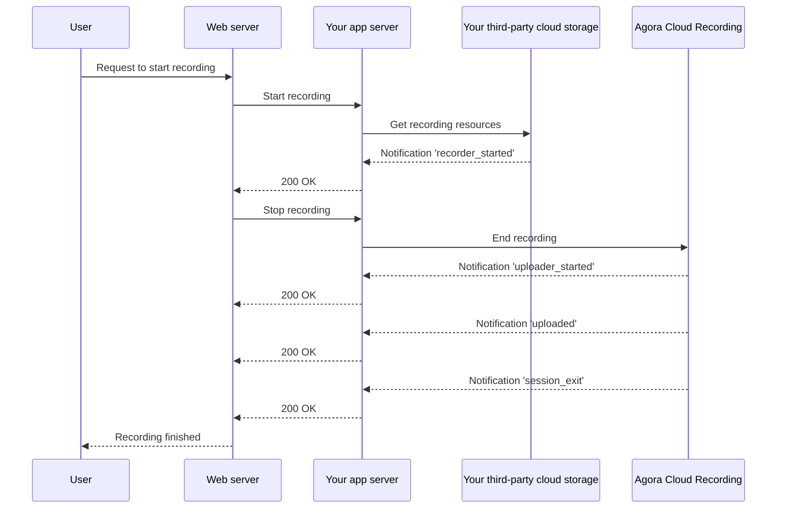

# Sequence Diagram

```mermaid
sequenceDiagram
    participant User1 as User
    participant Web_Server1 as Web server
    participant Your_App_Server as Your app server
    participant Your_Third_Party_Cloud_Storage as Your third-party cloud storage
    participant Agora_Cloud_Recording as Agora Cloud Recording

    User1->>Web_Server1: Request to start recording
    Web_Server1->>Your_App_Server: Start recording
    Your_App_Server->>Your_Third_Party_Cloud_Storage: Get recording resources
    Your_Third_Party_Cloud_Storage-->>Your_App_Server: Notification 'recorder_started'
    Your_App_Server-->>Web_Server1: 200 OK
    Web_Server1->>Your_App_Server: Stop recording
    Your_App_Server->>Agora_Cloud_Recording: End recording
    Agora_Cloud_Recording-->>Your_App_Server: Notification 'uploader_started'
    Your_App_Server-->>Web_Server1: 200 OK
    Agora_Cloud_Recording-->>Your_App_Server: Notification 'uploaded'
    Your_App_Server-->>Web_Server1: 200 OK
    Agora_Cloud_Recording-->>Your_App_Server: Notification 'session_exit'
    Your_App_Server-->>Web_Server1: 200 OK
    Web_Server1-->>User1: Recording finished
```
