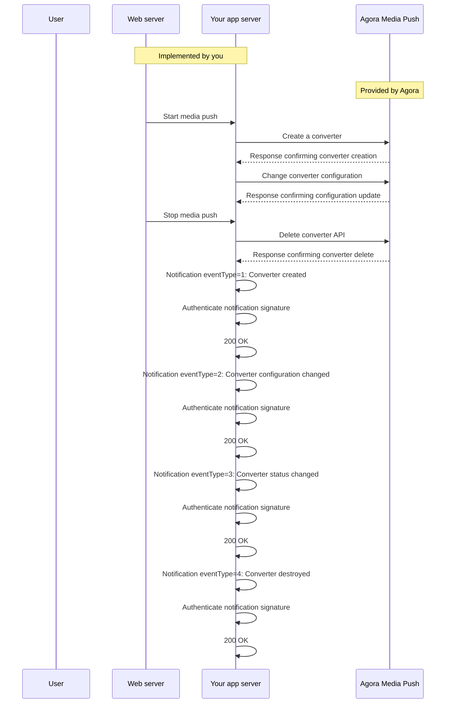

# Sequence Diagram

```mermaid
sequenceDiagram
    participant User
    participant WebServer as Web server
    participant AppServer as Your app server
    participant Agora as Agora Media Push

    rect rgb(255, 255, 255)
        note over WebServer, AppServer: Implemented by you
    end
    rect rgb(255, 255, 255)
        note over Agora: Provided by Agora
    end

    WebServer->>AppServer: Start media push
    AppServer->>Agora: Create a converter
    Agora-->>AppServer: Response confirming converter creation
    AppServer->>Agora: Change converter configuration
    Agora-->>AppServer: Response confirming configuration update
    WebServer->>AppServer: Stop media push
    AppServer->>Agora: Delete converter API
    Agora-->>AppServer: Response confirming converter delete

    AppServer->>AppServer: Notification eventType=1: Converter created
    AppServer->>AppServer: Authenticate notification signature
    AppServer->>AppServer: 200 OK
    
    AppServer->>AppServer: Notification eventType=2: Converter configuration changed
    AppServer->>AppServer: Authenticate notification signature
    AppServer->>AppServer: 200 OK
    
    AppServer->>AppServer: Notification eventType=3: Converter status changed
    AppServer->>AppServer: Authenticate notification signature
    AppServer->>AppServer: 200 OK

    AppServer->>AppServer: Notification eventType=4: Converter destroyed
    AppServer->>AppServer: Authenticate notification signature
    AppServer->>AppServer: 200 OK
```
