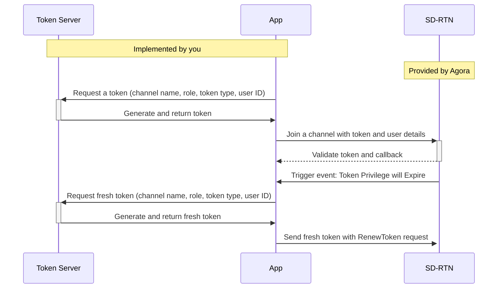

# Sequence Diagram

```mermaid
sequenceDiagram
    participant TokenServer as Token Server
    participant App as App
    participant SDRTN as SD-RTN

    note over TokenServer, App : Implemented by you
    note over SDRTN : Provided by Agora

    App->>+TokenServer: Request a token (channel name, role, token type, user ID)
    TokenServer->>-App: Generate and return token
    App->>+SDRTN: Join a channel with token and user details
    SDRTN-->>-App: Validate token and callback

    SDRTN->>App: Trigger event: Token Privilege will Expire
    App->>+TokenServer: Request fresh token (channel name, role, token type, user ID)
    TokenServer->>-App: Generate and return fresh token
    App->>+SDRTN: Send fresh token with RenewToken request
```
