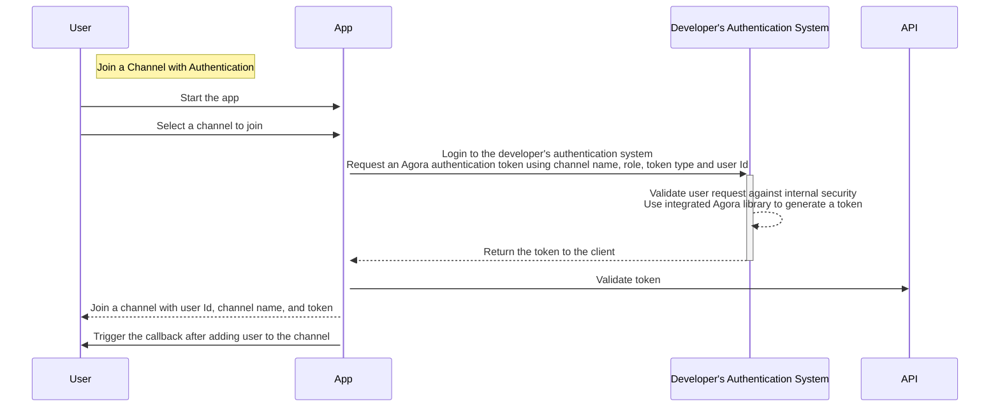

# Sequence Diagram

```mermaid
sequenceDiagram
    participant User as User
    participant App as App
    participant DevAuth as Developer's Authentication System
    participant API as API

    note right of User: Join a Channel with Authentication

    User ->>+ App: Start the app
    User ->>+ App: Select a channel to join

    App ->>+ DevAuth: Login to the developer's authentication system<br/>Request an Agora authentication token using channel name, role, token type and user Id

    DevAuth -->> DevAuth: Validate user request against internal security<br/>Use integrated Agora library to generate a token

    DevAuth -->>- App: Return the token to the client

    App ->> API: Validate token
    App -->> User: Join a channel with user Id, channel name, and token
    App ->> User: Trigger the callback after adding user to the channel
```
