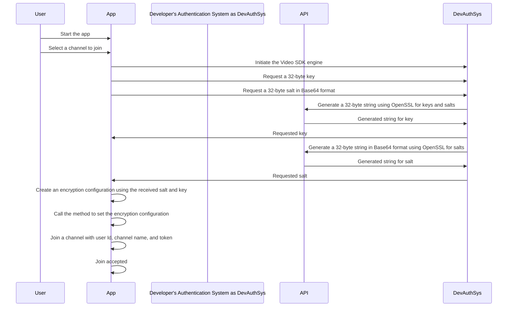

# Sequence Diagram

```mermaid
sequenceDiagram
    participant User
    participant App
    participant Developer's Authentication System as DevAuthSys
    participant API

    User->>App: Start the app
    User->>App: Select a channel to join

    App->>DevAuthSys: Initiate the Video SDK engine
    App->>DevAuthSys: Request a 32-byte key
    App->>DevAuthSys: Request a 32-byte salt in Base64 format

    DevAuthSys->>API: Generate a 32-byte string using OpenSSL for keys and salts
    API->>DevAuthSys: Generated string for key
    DevAuthSys->>App: Requested key

    DevAuthSys->>API: Generate a 32-byte string in Base64 format using OpenSSL for salts
    API->>DevAuthSys: Generated string for salt
    DevAuthSys->>App: Requested salt

    App->>App: Create an encryption configuration using the received salt and key
    App->>App: Call the method to set the encryption configuration

    App->>App: Join a channel with user Id, channel name, and token
    App->>App: Join accepted
```
