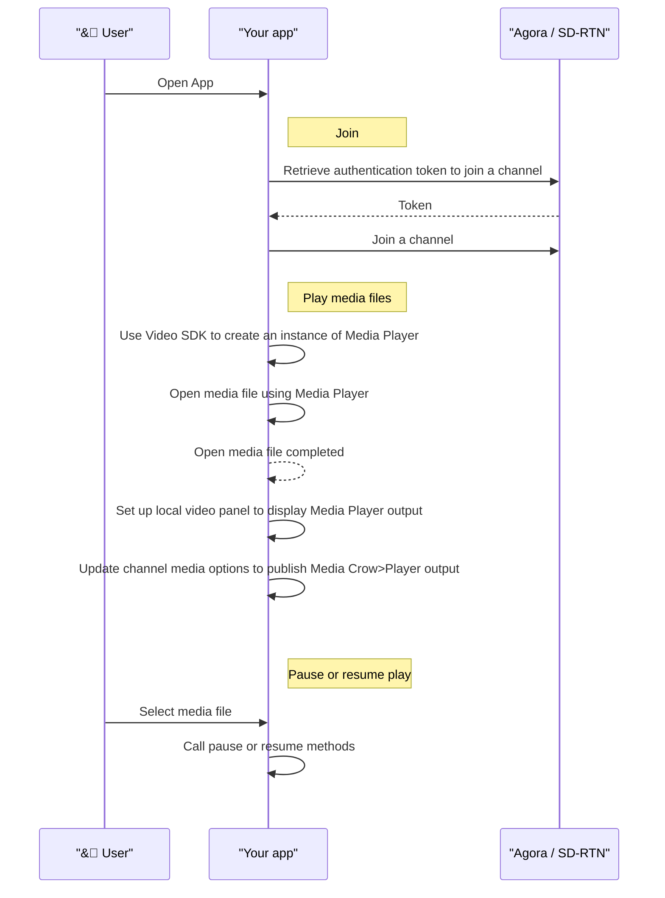

# Sequence Diagram

```mermaid
sequenceDiagram
    participant User as "&#128100; User"
    participant Your_app as "Your app"
    participant Agora as "Agora / SD-RTN"

    User->>Your_app: Open App
    rect rgb(255, 255, 255)
        Note right of Your_app: Join
        Your_app->>Agora: Retrieve authentication token to join a channel
        Agora-->>Your_app: Token
        Your_app->>Agora: Join a channel
    end
    rect rgb(255, 255, 255)
        Note right of Your_app: Play media files
        Your_app->>Your_app: Use Video SDK to create an instance of Media Player
        Your_app->>Your_app: Open media file using Media Player
        Your_app-->>Your_app: Open media file completed
        Your_app->>Your_app: Set up local video panel to display Media Player output
        Your_app->>Your_app: Update channel media options to publish Media Crow>Player output
    end
    rect rgb(255, 255, 255)
        Note right of Your_app: Pause or resume play
        User->>Your_app: Select media file
        Your_app->>Your_app: Call pause or resume methods
    end
```
