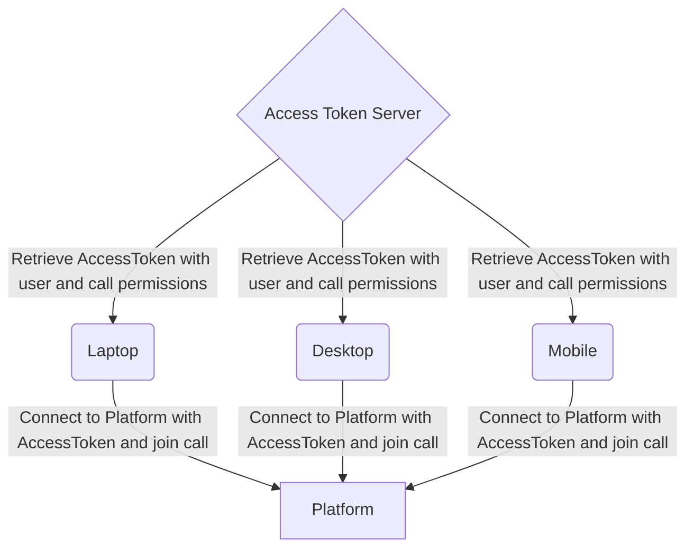

# Sequence Diagram

```mermaid
flowchart TD
    platform[Platform]
    laptop(Laptop)
    desktop(Desktop)
    mobile(Mobile)
    server{Access Token Server}

    server -->|Retrieve AccessToken with user and call permissions| laptop
    server -->|Retrieve AccessToken with user and call permissions| desktop
    server -->|Retrieve AccessToken with user and call permissions| mobile

    laptop -->|Connect to Platform with AccessToken and join call| platform
    desktop -->|Connect to Platform with AccessToken and join call| platform
    mobile -->|Connect to Platform with AccessToken and join call| platform
```
