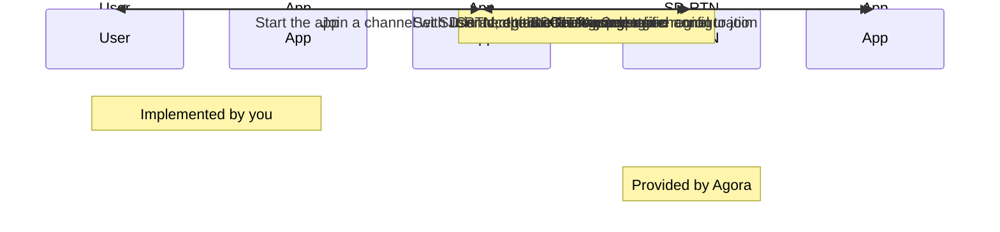

# Sequence Diagram

```mermaid
sequenceDiagram
  %% Subgraphs corresponding to designated groups
  rect rgb(255, 255, 255)
    note over User,App: Implemented by you
    participant User as User
    participant App1 as App
  end
  
  rect rgb(255, 255, 255)
    note over SD-RTN: Provided by Agora
    participant SD-RTN as SD-RTN
  end
  
  rect rgb(255, 255, 255)
    participant App2 as App
  end

  %% User interactions
  User->>App1: Start the app

  %% Geofencing sub-sequence
  rect rgb(255, 255, 255)
    note over App1,SD-RTN: Geofencing
    App1->>SD-RTN: Set SD-RTN region in the Agora engine configuration
    activate SD-RTN
    SD-RTN->>App1: Initiate the Agora engine
    App1->>SD-RTN: Connect to SD-RTN in a specific region
    SD-RTN->>App1: Success response
    deactivate SD-RTN
  end

  %% Further App functionality
  App1->>App2: Select a channel to join
  activate App2
  App2->>User: Join a channel with user Id, channel name, and token
  activate User
  User->>App2: Join accepted
  deactivate User
  deactivate App2
```
