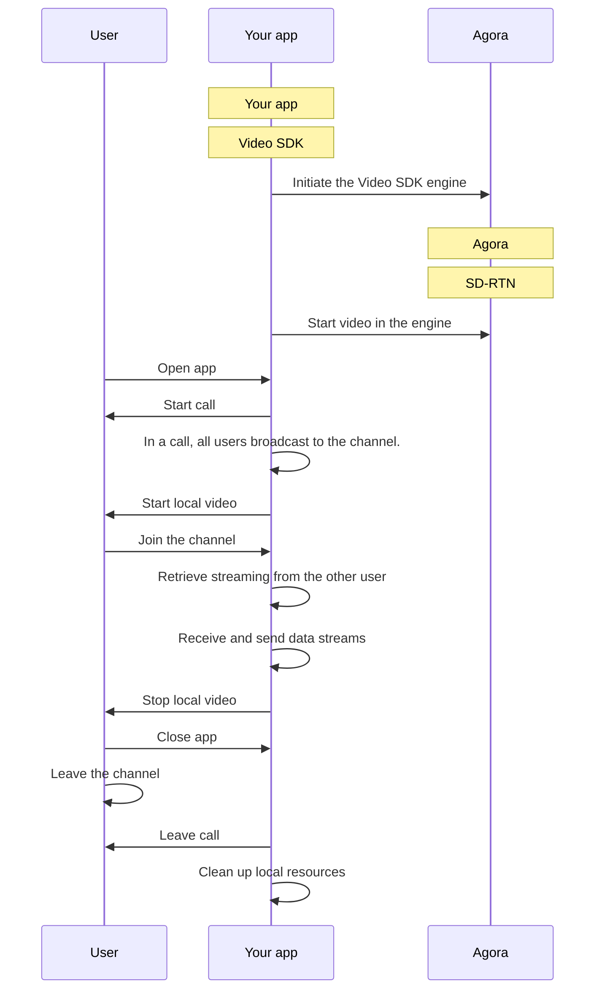

# Sequence Diagram

```mermaid
sequenceDiagram
    participant User as User
    participant App as Your app
    participant Agora as Agora

    rect rgb(255, 255, 255)
    note over App: Your app
    note over App: Video SDK
    App ->> Agora: Initiate the Video SDK engine
    end

    rect rgb(255, 255, 255)
    note over Agora: Agora
    note over Agora: SD-RTN
    App ->> Agora: Start video in the engine
    end

    User ->> App: Open app
    App ->> User: Start call
    App ->> App: In a call, all users broadcast to the channel.
    App ->> User: Start local video
    User ->> App: Join the channel
    App ->> App: Retrieve streaming from the other user
    App ->> App: Receive and send data streams
    App ->> User: Stop local video
    User ->> App: Close app
    User ->> User: Leave the channel
    App ->> User: Leave call
    App ->> App: Clean up local resources
```
