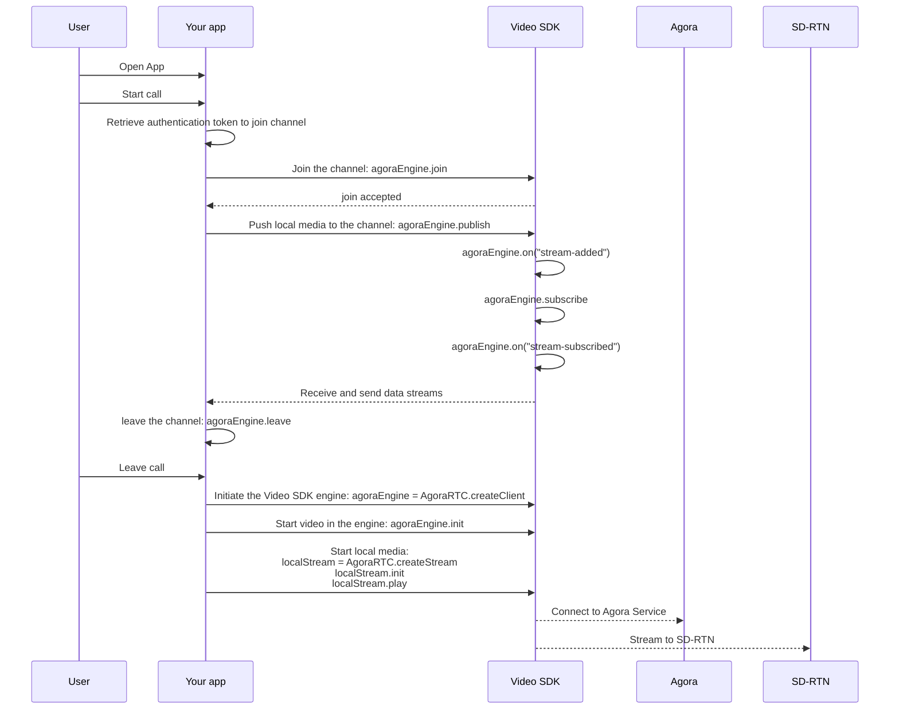

# Sequence Diagram

```mermaid
sequenceDiagram
participant User
participant Your_app as Your app
participant Video_SDK as Video SDK
participant Agora
participant SD_RTN as SD-RTN

User->>Your_app: Open App
User->>Your_app: Start call
Your_app->>Your_app: Retrieve authentication token to join channel
Your_app->>Video_SDK: Join the channel: agoraEngine.join
Video_SDK-->>Your_app: join accepted
Your_app->>Video_SDK: Push local media to the channel: agoraEngine.publish
Video_SDK->>Video_SDK: agoraEngine.on("stream-added")
Video_SDK->>Video_SDK: agoraEngine.subscribe
Video_SDK->>Video_SDK: agoraEngine.on("stream-subscribed")
Video_SDK-->>Your_app: Receive and send data streams
Your_app->>Your_app: leave the channel: agoraEngine.leave
User->>Your_app: Leave call

Your_app->>Video_SDK: Initiate the Video SDK engine: agoraEngine = AgoraRTC.createClient
Your_app->>Video_SDK: Start video in the engine: agoraEngine.init
Your_app->>Video_SDK: Start local media: <br/> localStream = AgoraRTC.createStream <br/> localStream.init <br/> localStream.play

Video_SDK-->>Agora: Connect to Agora Service
Video_SDK-->>SD_RTN: Stream to SD-RTN
```
