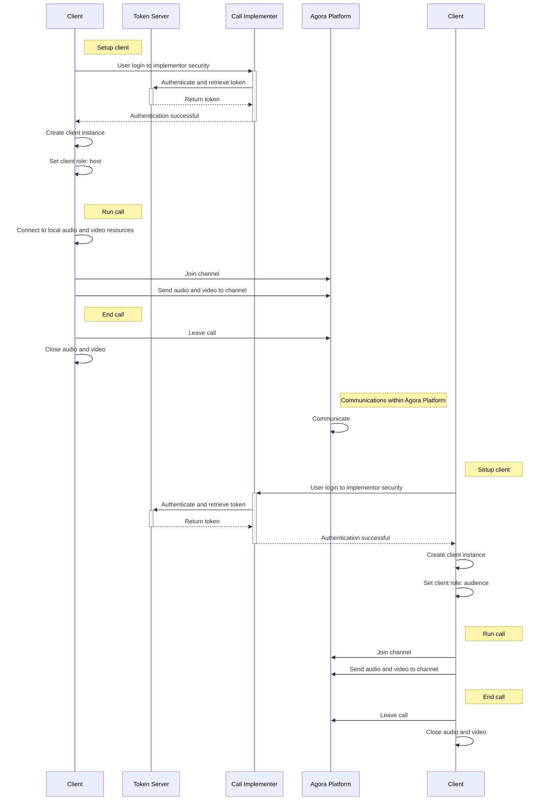

# Sequence Diagram

```mermaid
sequenceDiagram
    participant Client1 as Client
    participant Token_Server as Token Server
    participant Call_Implementer as Call Implementer
    participant Agora_Platform as Agora Platform
    participant Client2 as Client

    rect rgb(255, 255, 255)
        note right of Client1: Setup client
        Client1->>+Call_Implementer: User login to implementor security
        Call_Implementer->>+Token_Server: Authenticate and retrieve token
        Token_Server-->>-Call_Implementer: Return token
        Call_Implementer-->>-Client1: Authentication successful

        Client1->>Client1: Create client instance
        Client1->>Client1: Set client role: host
    end

    rect rgb(255, 255, 255)
        note right of Client1: Run call
        Client1->>Client1: Connect to local audio and video resources
    end

    Client1->>Agora_Platform: Join channel
    Client1->>Agora_Platform: Send audio and video to channel
    
    rect rgb(255, 255, 255)
        note right of Client1: End call
        Client1->>Agora_Platform: Leave call
        Client1->>Client1: Close audio and video
    end

    rect rgb(255, 255, 255)
        note right of Agora_Platform: Communications within Agora Platform
        Agora_Platform->>Agora_Platform: Communicate
    end

    rect rgb(255, 255, 255)
        note right of Client2: Setup client
        Client2->>+Call_Implementer: User login to implementor security
        Call_Implementer->>+Token_Server: Authenticate and retrieve token
        Token_Server-->>-Call_Implementer: Return token
        Call_Implementer-->>-Client2: Authentication successful

        Client2->>Client2: Create client instance
        Client2->>Client2: Set client role: audience
    end

    rect rgb(255, 255, 255)
        note right of Client2: Run call
        Client2->>Agora_Platform: Join channel
        Client2->>Agora_Platform: Send audio and video to channel
    end

    rect rgb(255, 255, 255)
        note right of Client2: End call
        Client2->>Agora_Platform: Leave call
        Client2->>Client2: Close audio and video
    end
```
