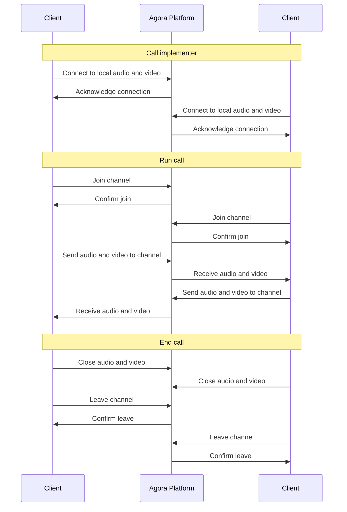

# Sequence Diagram

```mermaid
sequenceDiagram
    participant Client1 as Client
    participant Agora as Agora Platform
    participant Client2 as Client

    rect rgb(255, 255, 255)
        note over Client1, Client2: Call implementer
        Client1->>Agora: Connect to local audio and video
        Agora->>Client1: Acknowledge connection
        Client2->>Agora: Connect to local audio and video
        Agora->>Client2: Acknowledge connection
    end

    rect rgb(255, 255, 255)
        note over Client1, Client2: Run call
        Client1->>Agora: Join channel
        Agora->>Client1: Confirm join
        Client2->>Agora: Join channel
        Agora->>Client2: Confirm join
        
        Client1->>Agora: Send audio and video to channel
        Agora->>Client2: Receive audio and video
        Client2->>Agora: Send audio and video to channel
        Agora->>Client1: Receive audio and video
    end

    rect rgb(255, 255, 255)
        note over Client1, Client2: End call
        Client1->>Agora: Close audio and video
        Client2->>Agora: Close audio and video
        Client1->>Agora: Leave channel
        Agora->>Client1: Confirm leave
        Client2->>Agora: Leave channel
        Agora->>Client2: Confirm leave
    end
```
