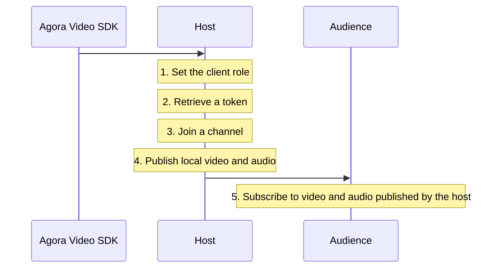

# Sequence Diagram

```mermaid
sequenceDiagram
    participant Agora_Video_SDK as Agora Video SDK
    participant Host
    participant Audience

    Agora_Video_SDK ->> Host: 
    note over Host: 1. Set the client role
    note over Host: 2. Retrieve a token
    note over Host: 3. Join a channel
    note over Host: 4. Publish local video and audio
    Host ->> Audience: 
    note over Audience: 5. Subscribe to video and audio published by the host
```
