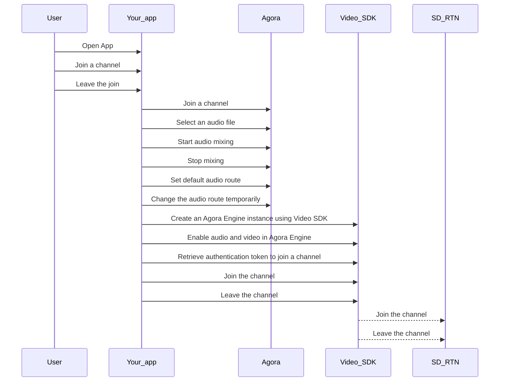

# Sequence Diagram

```mermaid
sequenceDiagram
    participant User
    participant Your_app
    participant Agora
    participant Video_SDK
    participant SD_RTN

    User->>Your_app: Open App
    User->>Your_app: Join a channel
    User->>Your_app: Leave the join

    Your_app->>Agora: Join a channel
    Your_app->>Agora: Select an audio file
    Your_app->>Agora: Start audio mixing
    Your_app->>Agora: Stop mixing
    Your_app->>Agora: Set default audio route
    Your_app->>Agora: Change the audio route temporarily

    Your_app->>Video_SDK: Create an Agora Engine instance using Video SDK
    Your_app->>Video_SDK: Enable audio and video in Agora Engine
    Your_app->>Video_SDK: Retrieve authentication token to join a channel
    Your_app->>Video_SDK: Join the channel
    Your_app->>Video_SDK: Leave the channel

    Video_SDK-->>SD_RTN: Join the channel
    Video_SDK-->>SD_RTN: Leave the channel
```
