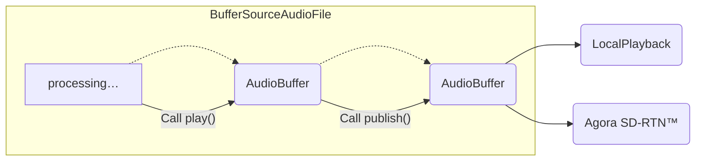

# Sequence Diagram

```mermaid
flowchart LR
    subgraph "BufferSourceAudioFile"
    direction LR
    MP3Icon["processing&hellip;"] -.-> AudioBuffer1(AudioBuffer) -.-> AudioBuffer2(AudioBuffer)
    MP3Icon -- "Call play()" --> AudioBuffer1
    AudioBuffer1 -- "Call publish()" --> AudioBuffer2
    end

    AudioBuffer2 --> LocalPlayback(LocalPlayback)
    AudioBuffer2 --> AgoraSDRTN(Agora SD-RTN&trade;)
```
