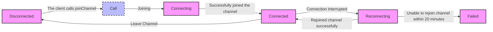

# Sequence Diagram

```mermaid
flowchart LR
    Disconnected --> |"The client calls joinChannel"| Call
    Call --> |"Joining"| Connecting
    Connecting --> |"Successfully joined the channel"| Connected
    Connected --> |"Connection Interrupted"| Reconnecting
    Connected --> |"Leave Channel"| Disconnected
    Reconnecting --> |"Rejoined channel successfully"| Connected
    Reconnecting --> |"Unable to rejoin channel within 20 minutes"| Failed

    style Disconnected fill:#f9f,stroke:#333,stroke-width:2px
    style Connecting fill:#f9f,stroke:#333,stroke-width:2px
    style Connected fill:#f9f,stroke:#333,stroke-width:2px
    style Reconnecting fill:#f9f,stroke:#333,stroke-width:2px
    style Failed fill:#f9f,stroke:#333,stroke-width:2px
    style Call fill:#bbf,stroke:#333,stroke-width:2px,stroke-dasharray: 5 5
```
