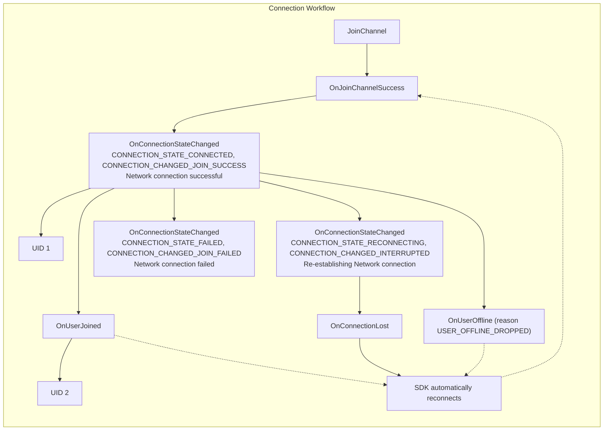

# Sequence Diagram

```mermaid
flowchart LR
    subgraph "Connection Workflow"
        T0["JoinChannel"] --> T1["OnJoinChannelSuccess"]
        T1 --> T2["OnConnectionStateChanged<br/>CONNECTION_STATE_CONNECTED, CONNECTION_CHANGED_JOIN_SUCCESS<br/>Network connection successful"]
        T2 --> T3["OnUserJoined"]
        T2 --> UID1["UID 1"]
        T3 --> UID2["UID 2"]
        T3 -.-> T5["SDK automatically reconnects"]
        T2 --> T4["OnConnectionStateChanged<br/>CONNECTION_STATE_RECONNECTING, CONNECTION_CHANGED_INTERRUPTED<br/>Re-establishing Network connection"]
        T4 --> T6["OnConnectionLost"]
        T6 --> T5
        T5 -.-> T1
        T2 --> T7["OnUserOffline (reason USER_OFFLINE_DROPPED)"]
        T7 -.-> T5
        T2 --> FailedState["OnConnectionStateChanged<br/>CONNECTION_STATE_FAILED, CONNECTION_CHANGED_JOIN_FAILED<br/>Network connection failed"]
    end
```
