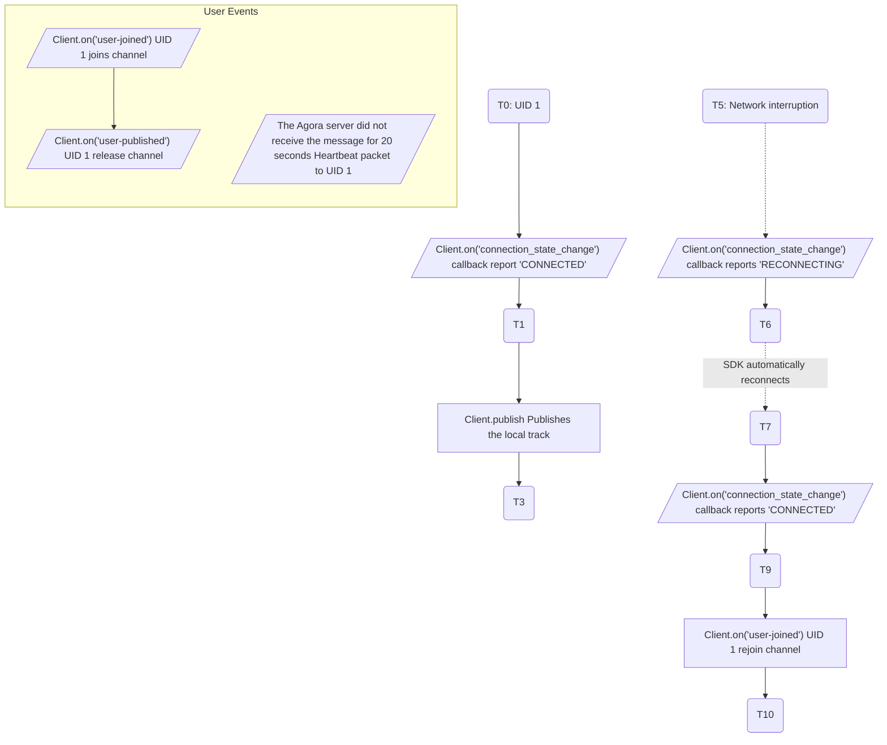

# Sequence Diagram

```mermaid
flowchart TD
    T0("T0: UID 1") --> ConnectStatus[/"Client.on('connection_state_change') callback report 'CONNECTED'"/]
    ConnectStatus --> T1("T1")
    T1 --> PublishAction["Client.publish Publishes the local track"]
    PublishAction --> T3("T3")
    T5("T5: Network interruption") -.-> Reconnecting[/"Client.on('connection_state_change') callback reports 'RECONNECTING'"/]
    Reconnecting --> T6("T6")
    T6 -. "SDK automatically reconnects" .-> T7("T7")
    T7 --> Reconnected[/"Client.on('connection_state_change') callback reports 'CONNECTED'"/]
    Reconnected --> T9("T9")
    T9 --> Rejoin["Client.on('user-joined') UID 1 rejoin channel"]
    Rejoin --> T10("T10")

    subgraph UserEvents["User Events"]
        direction TB
        UserJoined[/"Client.on('user-joined') UID 1 joins channel"/] --> UserPublished[/"Client.on('user-published') UID 1 release channel"/]
        heartbeat[/"The Agora server did not receive the message for 20 seconds Heartbeat packet to UID 1"/]
    end
```
