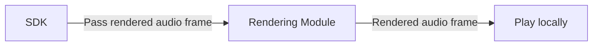

# Sequence Diagram

```mermaid
flowchart LR
    SDK["SDK"] --> |"Pass rendered audio frame"| Rendering_Module["Rendering Module"]
    Rendering_Module["Rendering Module"] --> |"Rendered audio frame"| Play_locally["Play locally"]
```
