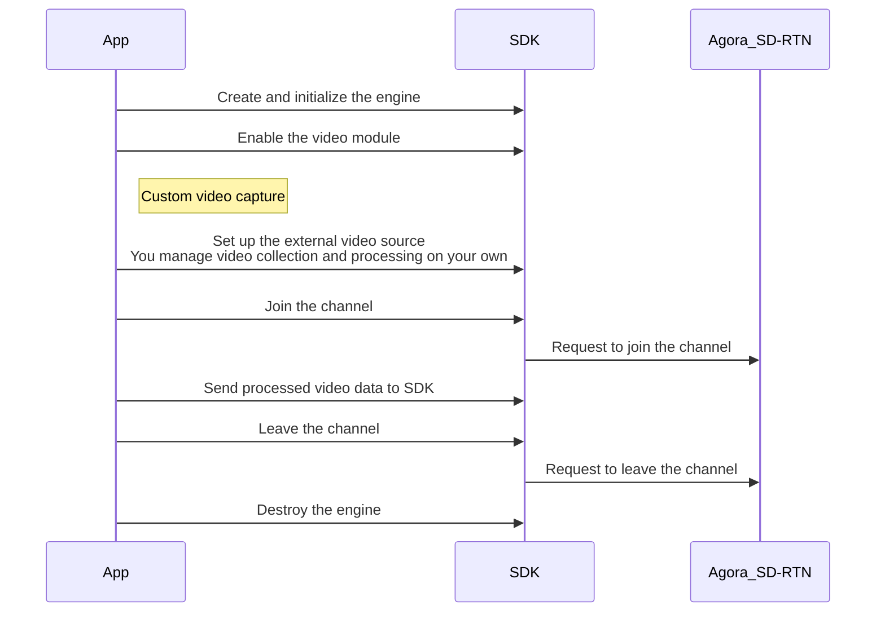

# Sequence Diagram

```mermaid
sequenceDiagram
    participant App
    participant SDK
    participant Agora_SD-RTN

    App->>SDK: Create and initialize the engine
    App->>SDK: Enable the video module
    rect rgb(255, 255, 255)
    note right of App: Custom video capture
    App->>SDK: Set up the external video source<br> You manage video collection and processing on your own
    end
    App->>SDK: Join the channel
    SDK->>Agora_SD-RTN: Request to join the channel
    App->>SDK: Send processed video data to SDK
    App->>SDK: Leave the channel
    SDK->>Agora_SD-RTN: Request to leave the channel
    App->>SDK: Destroy the engine
```
