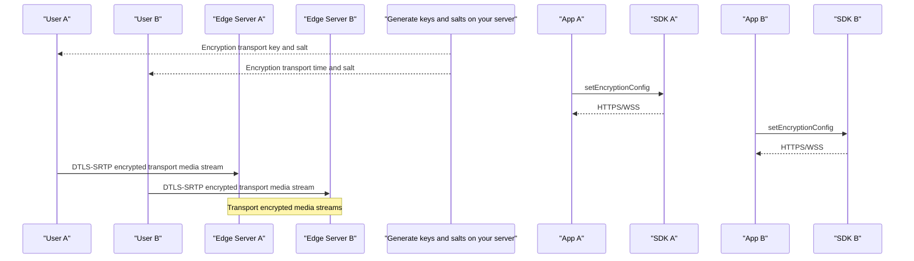

# Sequence Diagram

```mermaid
sequenceDiagram
    participant User_A as "User A"
    participant User_B as "User B"
    participant Edge_Server_A as "Edge Server A"
    participant Edge_Server_B as "Edge Server B"
    participant Key_Generator as "Generate keys and salts on your server"
    participant App_A as "App A"
    participant SDK_A as "SDK A"
    participant App_B as "App B"
    participant SDK_B as "SDK B"

    Key_Generator -->> User_A: Encryption transport key and salt
    Key_Generator -->> User_B: Encryption transport time and salt

    App_A ->> SDK_A: setEncryptionConfig
    SDK_A -->> App_A: HTTPS/WSS
    App_B ->> SDK_B: setEncryptionConfig
    SDK_B -->> App_B: HTTPS/WSS

    User_A ->> Edge_Server_A: DTLS-SRTP encrypted transport media stream
    User_B ->> Edge_Server_B: DTLS-SRTP encrypted transport media stream

    Note over Edge_Server_A, Edge_Server_B: Transport encrypted media streams
```
