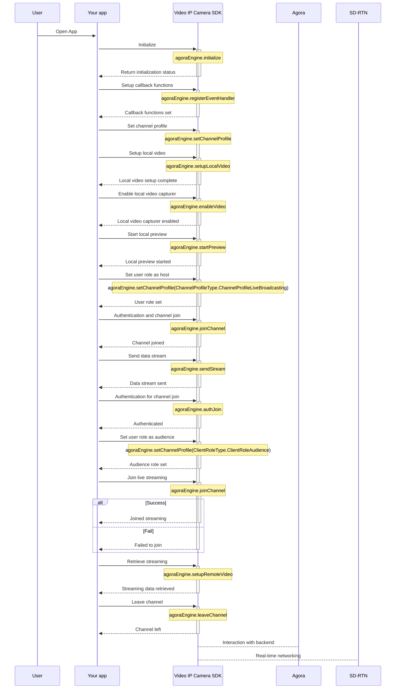

# Sequence Diagram

```mermaid
sequenceDiagram
    participant User
    participant Your_app as Your app
    participant Video_SDK as Video IP Camera SDK
    participant Agora
    participant SD_RTN as SD-RTN

    User->>+Your_app: Open App
    Your_app->>+Video_SDK: Initialize
    activate Video_SDK
    Note over Video_SDK: agoraEngine.initialize
    Video_SDK-->>-Your_app: Return initialization status
    deactivate Video_SDK

    Your_app->>+Video_SDK: Setup callback functions
    Note over Video_SDK: agoraEngine.registerEventHandler
    Video_SDK-->>-Your_app: Callback functions set

    Your_app->>+Video_SDK: Set channel profile
    Note over Video_SDK: agoraEngine.setChannelProfile

    Your_app->>+Video_SDK: Setup local video
    Note over Video_SDK: agoraEngine.setupLocalVideo
    Video_SDK-->>-Your_app: Local video setup complete

    Your_app->>+Video_SDK: Enable local video capturer
    Note over Video_SDK: agoraEngine.enableVideo
    Video_SDK-->>-Your_app: Local video capturer enabled

    Your_app->>+Video_SDK: Start local preview
    Note over Video_SDK: agoraEngine.startPreview
    Video_SDK-->>-Your_app: Local preview started

    Your_app->>+Video_SDK: Set user role as host
    Note over Video_SDK: agoraEngine.setChannelProfile(ChannelProfileType.ChannelProfileLiveBroadcasting)
    Video_SDK-->>-Your_app: User role set

    Your_app->>+Video_SDK: Authentication and channel join
    Note over Video_SDK: agoraEngine.joinChannel
    Video_SDK-->>-Your_app: Channel joined

    Your_app->>+Video_SDK: Send data stream
    Note over Video_SDK: agoraEngine.sendStream
    Video_SDK-->>-Your_app: Data stream sent

    Your_app->>+Video_SDK: Authentication for channel join
    Note over Video_SDK: agoraEngine.authJoin
    Video_SDK-->>-Your_app: Authenticated

    Your_app->>+Video_SDK: Set user role as audience
    Note over Video_SDK: agoraEngine.setChannelProfile(ClientRoleType.ClientRoleAudience)
    Video_SDK-->>-Your_app: Audience role set

    Your_app->>+Video_SDK: Join live streaming
    Note over Video_SDK: agoraEngine.joinChannel
    alt Success
        Video_SDK-->>-Your_app: Joined streaming
    else Fail
        Video_SDK-->>-Your_app: Failed to join
    end

    Your_app->>+Video_SDK: Retrieve streaming
    Note over Video_SDK: agoraEngine.setupRemoteVideo
    Video_SDK-->>-Your_app: Streaming data retrieved

    Your_app->>+Video_SDK: Leave channel
    Note over Video_SDK: agoraEngine.leaveChannel
    Video_SDK-->>-Your_app: Channel left

    Video_SDK --> Agora :Interaction with backend
    Video_SDK --> SD_RTN : Real-time networking
```
