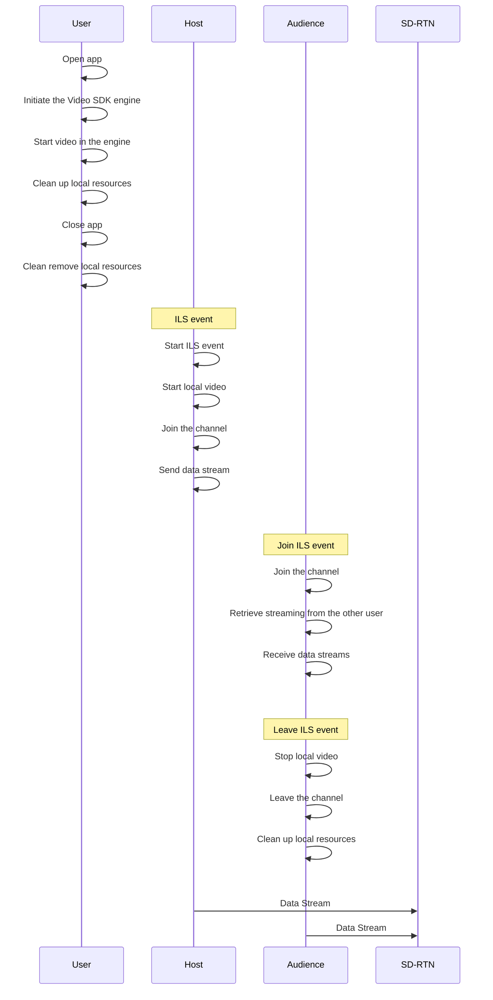

# Sequence Diagram

```mermaid
sequenceDiagram
    participant User
    participant Host
    participant Audience
    participant SD-RTN

    %% User Interactions
    User ->> User: Open app
    User ->> User: Initiate the Video SDK engine
    User ->> User: Start video in the engine
    User ->> User: Clean up local resources
    User ->> User: Close app
    User ->> User: Clean remove local resources
    %% End User Interactions

    %% Host Interactions
    rect rgb(255, 255, 255)
    Note over Host: ILS event
    Host ->> Host: Start ILS event
    Host ->> Host: Start local video
    Host ->> Host: Join the channel
    Host ->> Host: Send data stream
    end
    %% End Host Interactions

    %% Audience Interactions
    rect rgb(255, 255, 255)
    Note over Audience: Join ILS event
    Audience ->> Audience: Join the channel
    Audience ->> Audience: Retrieve streaming from the other user
    Audience ->> Audience: Receive data streams
    end

    rect rgb(255, 255, 255)
    Note over Audience: Leave ILS event
    Audience ->> Audience: Stop local video
    Audience ->> Audience: Leave the channel
    Audience ->> Audience: Clean up local resources
    end
    %% End Audience Interactions

    %% Data Streams from Host and Audience to SD-RTN
    Host ->> SD-RTN: Data Stream
    Audience ->> SD-RTN: Data Stream
    %% End Data Streams
```
