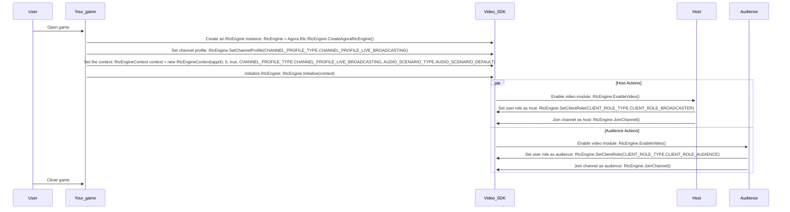

# Sequence Diagram

```mermaid
sequenceDiagram
    participant User
    participant Your_game
    participant Video_SDK
    participant Host
    participant Audience

    User->>+Your_game: Open game
    Your_game->>+Video_SDK: Create an RtcEngine instance: RtcEngine = Agora.Rtc.RtcEngine.CreateAgoraRtcEngine()
    Your_game->>Video_SDK: Set channel profile: RtcEngine.SetChannelProfile(CHANNEL_PROFILE_TYPE.CHANNEL_PROFILE_LIVE_BROADCASTING)
    Your_game->>Video_SDK: Set the context: RtcEngineContext context = new RtcEngineContext(appID, 0, true, CHANNEL_PROFILE_TYPE.CHANNEL_PROFILE_LIVE_BROADCASTING, AUDIO_SCENARIO_TYPE.AUDIO_SCENARIO_DEFAULT)
    Your_game->>Video_SDK: Initialize RtcEngine: RtcEngine.Initialize(context)
    
    par Host Actions
        Video_SDK->>+Host: Enable video module: RtcEngine.EnableVideo()
        Host->>Video_SDK: Set user role as host: RtcEngine.SetClientRole(CLIENT_ROLE_TYPE.CLIENT_ROLE_BROADCASTER)
        Host->>Video_SDK: Join channel as host: RtcEngine.JoinChannel()
    and Audience Actions
        Video_SDK->>+Audience: Enable video module: RtcEngine.EnableVideo()
        Audience->>Video_SDK: Set user role as audience: RtcEngine.SetClientRole(CLIENT_ROLE_TYPE.CLIENT_ROLE_AUDIENCE)
        Audience->>Video_SDK: Join channel as audience: RtcEngine.JoinChannel()
    end
    User->>+Your_game: Close game
```
