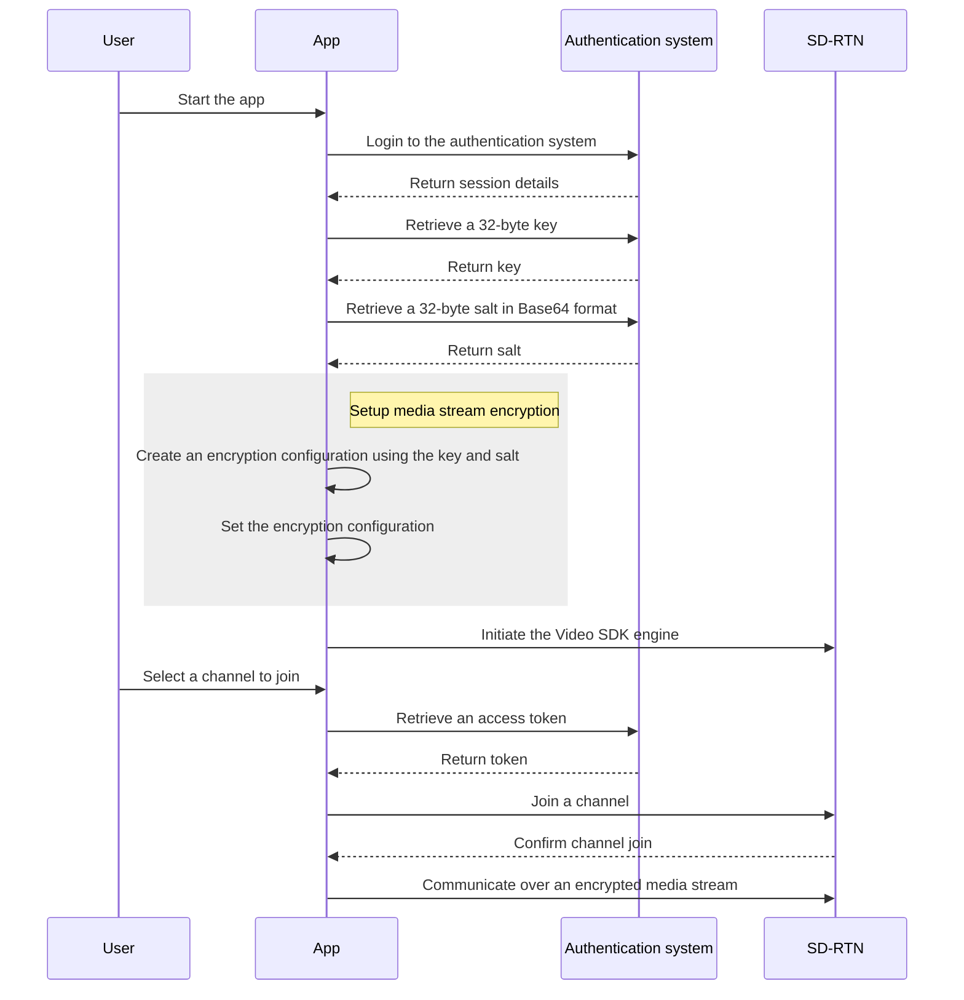

# Sequence Diagram

```mermaid
sequenceDiagram
    participant User
    participant App
    participant AuthSys as Authentication system
    participant SD_RTN as SD-RTN

    User->>App: Start the app
    App->>AuthSys: Login to the authentication system
    AuthSys-->>App: Return session details
    App->>AuthSys: Retrieve a 32-byte key
    AuthSys-->>App: Return key
    App->>AuthSys: Retrieve a 32-byte salt in Base64 format
    AuthSys-->>App: Return salt

    rect rgb(238,238,238)
    note right of App: Setup media stream encryption
    App->>App: Create an encryption configuration using the key and salt
    App->>App: Set the encryption configuration
    end

    App->>SD_RTN: Initiate the Video SDK engine
    User->>App: Select a channel to join
    App->>AuthSys: Retrieve an access token
    AuthSys-->>App: Return token
    App->>SD_RTN: Join a channel
    SD_RTN-->>App: Confirm channel join
    App->>SD_RTN: Communicate over an encrypted media stream
```
