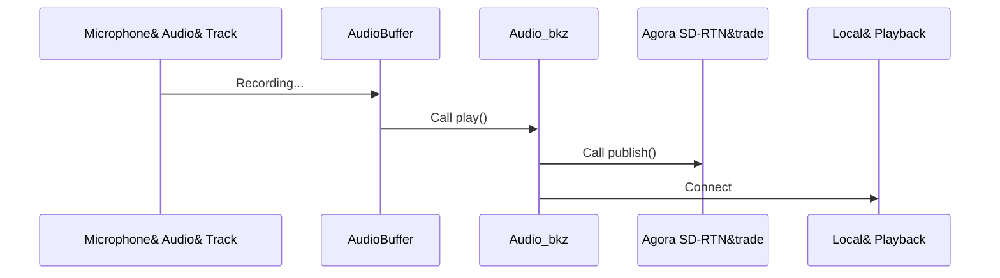

# Sequence Diagram

```mermaid
sequenceDiagram
    participant MicrophoneAudioTrack as Microphone&#10;Audio&#10;Track
    participant AudioBuffer1 as AudioBuffer
    participant AudioBuffer2 as Audio_bkz
    participant AgoraSDRTN as Agora SD-RTN&trade;
    participant LocalPlayback as Local&#10;Playback

    MicrophoneAudioTrack ->> AudioBuffer1: Recording...
    AudioBuffer1 ->> AudioBuffer2: Call play()
    AudioBuffer2 ->> AgoraSDRTN: Call publish()
    AudioBuffer2 ->> LocalPlayback: Connect
```
