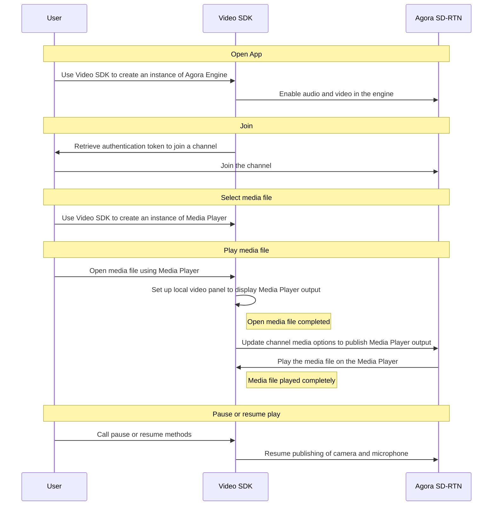

# Sequence Diagram

```mermaid
sequenceDiagram
    participant User as User
    participant Video_SDK as Video SDK
    participant Agora_SDR as Agora SD-RTN

    rect rgb(255, 255, 255)
        note over User, Agora_SDR: Open App
        User->>Video_SDK: Use Video SDK to create an instance of Agora Engine
        Video_SDK->>Agora_SDR: Enable audio and video in the engine
    end
    
    rect rgb(255, 255, 255)
        note over User, Agora_SDR: Join
        Video_SDK->>User: Retrieve authentication token to join a channel
        User->>Agora_SDR: Join the channel
    end
    
    rect rgb(255, 255, 255)
        note over User, Agora_SDR: Select media file
        User->>Video_SDK: Use Video SDK to create an instance of Media Player
    end
    
    rect rgb(255, 255, 255)
        note over User, Agora_SDR: Play media file
        User->>Video_SDK: Open media file using Media Player
        Video_SDK->>Video_SDK: Set up local video panel to display Media Player output
        Note right of Video_SDK: Open media file completed
        Video_SDK->>Agora_SDR: Update channel media options to publish Media Player output
        Agora_SDR->>Video_SDK: Play the media file on the Media Player
        Note right of Video_SDK: Media file played completely
    end
    
    rect rgb(255, 255, 255)
        note over User, Agora_SDR: Pause or resume play
        User->>Video_SDK: Call pause or resume methods
        Video_SDK->>Agora_SDR: Resume publishing of camera and microphone
    end
```
