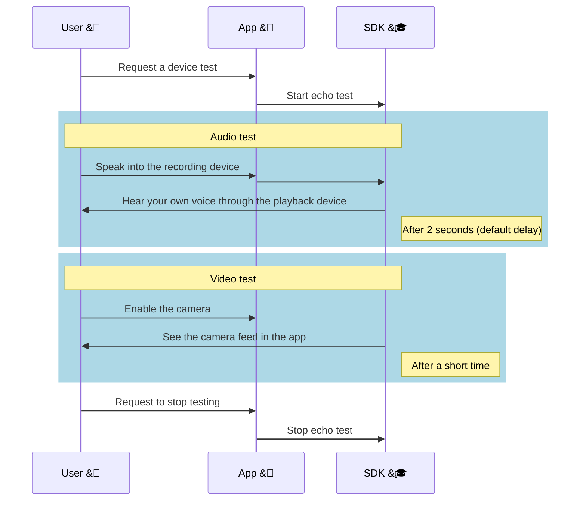

# Sequence Diagram

```mermaid
sequenceDiagram
  participant User as User &#128100;
  participant App as App &#128241;
  participant SDK as SDK &#127891;
  
  User->>App: Request a device test
  App->>SDK: Start echo test
  
  rect rgb(173, 216, 230)
    Note over User,SDK: Audio test
    User->>App: Speak into the recording device
    App->>SDK: 
    SDK->>User: Hear your own voice through the playback device
    Note right of SDK: After 2 seconds (default delay)
  end
  
  rect rgb(173, 216, 230)
    Note over User,SDK: Video test
    User->>App: Enable the camera
    SDK->>User: See the camera feed in the app
    Note right of SDK: After a short time
  end
  
  User->>App: Request to stop testing
  App->>SDK: Stop echo test
```
