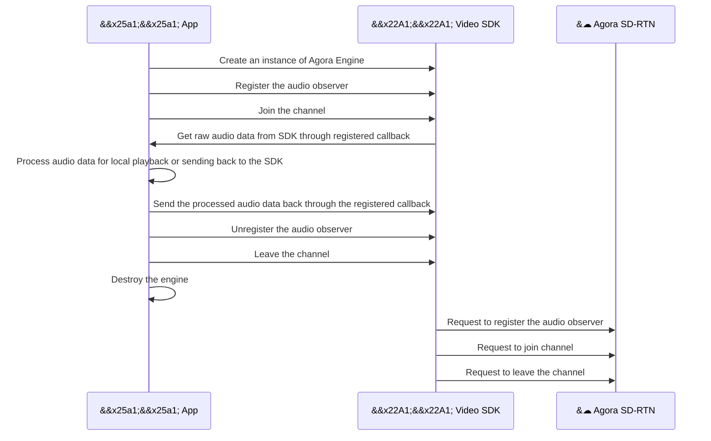

# Sequence Diagram

```mermaid
sequenceDiagram
    participant App as &#x25a1;&#x25a1; App
    participant Video_SDK as &#x22A1;&#x22A1; Video SDK
    participant Agora_SD_RTN as &#9729; Agora SD-RTN

    App->>Video_SDK: Create an instance of Agora Engine
    App->>Video_SDK: Register the audio observer
    App->>Video_SDK: Join the channel
    Video_SDK->>App: Get raw audio data from SDK through registered callback
    App->>App: Process audio data for local playback or sending back to the SDK
    App->>Video_SDK: Send the processed audio data back through the registered callback
    App->>Video_SDK: Unregister the audio observer
    App->>Video_SDK: Leave the channel
    App->>App: Destroy the engine

    Video_SDK->>Agora_SD_RTN: Request to register the audio observer
    Video_SDK->>Agora_SD_RTN: Request to join channel
    Video_SDK->>Agora_SD_RTN: Request to leave the channel
```
