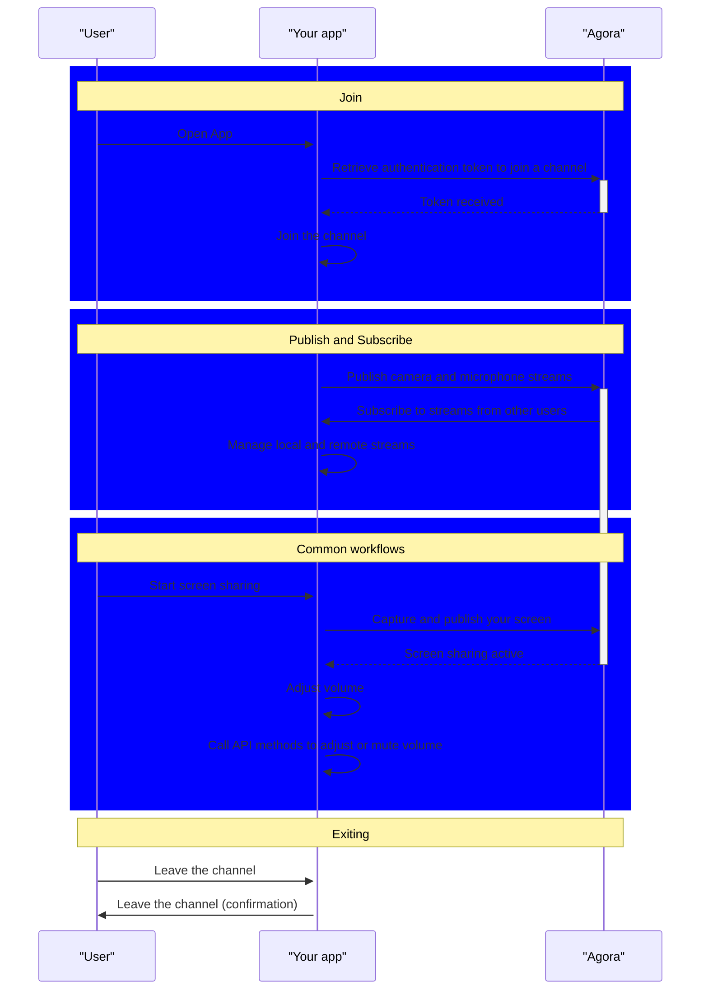

# Sequence Diagram

```mermaid
sequenceDiagram
    participant User as "User"
    participant App as "Your app"
    participant Agora as "Agora"

    rect rgb(0, 0, 255)
        Note over User, Agora: Join
        User->>+App: Open App
        App->>+Agora: Retrieve authentication token to join a channel
        Agora-->>-App: Token received
        App->>App: Join the channel
    end

    rect rgb(0, 0, 255)
        Note over User, Agora: Publish and Subscribe
        App->>+Agora: Publish camera and microphone streams
        Agora->>App: Subscribe to streams from other users
        App->>App: Manage local and remote streams
    end

    rect rgb(0, 0, 255)
        Note over User, Agora: Common workflows
        User->>+App: Start screen sharing
        App->>Agora: Capture and publish your screen
        Agora-->>-App: Screen sharing active
        App->>App: Adjust volume
        App->>App: Call API methods to adjust or mute volume
    end

    Note over User, Agora: Exiting
    User->>App: Leave the channel
    App->>User: Leave the channel (confirmation)
```
