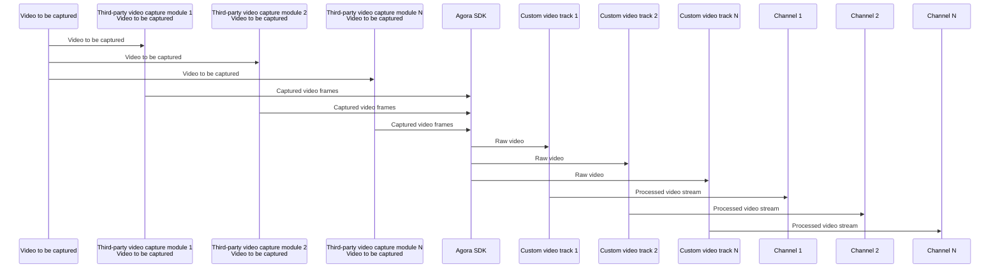

# Sequence Diagram

```mermaid
sequenceDiagram
    participant Video_to_be_captured as Video to be captured
    participant Third_party_video_capture_module_1 as Third-party video capture module 1<br/>Video to be captured
    participant Third_party_video_capture_module_2 as Third-party video capture module 2<br/>Video to be captured
    participant Third_party_video_capture_module_N as Third-party video capture module N<br/>Video to be captured
    participant Agora_SDK as Agora SDK
    participant Custom_video_track_1 as Custom video track 1
    participant Custom_video_track_2 as Custom video track 2
    participant Custom_video_track_N as Custom video track N
    participant Channel_1 as Channel 1
    participant Channel_2 as Channel 2
    participant Channel_N as Channel N

    Video_to_be_captured ->> Third_party_video_capture_module_1: Video to be captured
    Video_to_be_captured ->> Third_party_video_capture_module_2: Video to be captured
    Video_to_be_captured ->> Third_party_video_capture_module_N: Video to be captured

    Third_party_video_capture_module_1 ->> Agora_SDK: Captured video frames
    Third_party_video_capture_module_2 ->> Agora_SDK: Captured video frames
    Third_party_video_capture_module_N ->> Agora_SDK: Captured video frames

    Agora_SDK ->> Custom_video_track_1: Raw video
    Agora_SDK ->> Custom_video_track_2: Raw video
    Agora_SDK ->> Custom_video_track_N: Raw video

    Custom_video_track_1 ->> Channel_1: Processed video stream
    Custom_video_track_2 ->> Channel_2: Processed video stream
    Custom_video_track_N ->> Channel_N: Processed video stream
```
