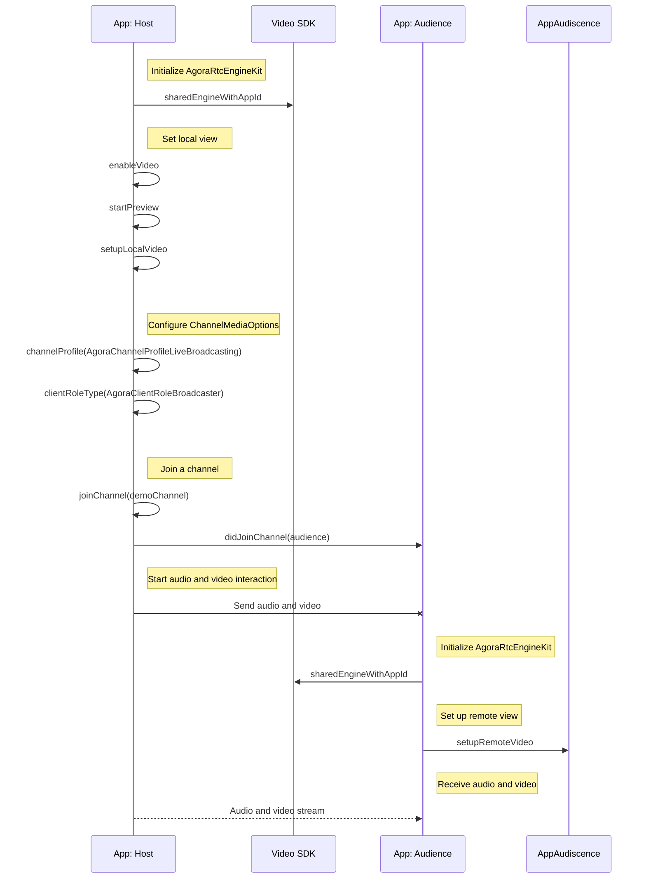

# Sequence Diagram

```mermaid
sequenceDiagram
    participant AppHost as App: Host
    participant VideoSDK as Video SDK
    participant AppAudience as App: Audience

    rect rgb(255,255,255)
        note right of AppHost: Initialize AgoraRtcEngineKit
        AppHost->>VideoSDK: sharedEngineWithAppId
    end

    rect rgb(255,255,255)
        note right of AppHost: Set local view
        AppHost->>AppHost: enableVideo
        AppHost->>AppHost: startPreview
        AppHost->>AppHost: setupLocalVideo
    end

    rect rgb(255,255,255)
        note right of AppHost: Configure ChannelMediaOptions
        AppHost->>AppHost: channelProfile(AgoraChannelProfileLiveBroadcasting)
        AppHost->>AppHost: clientRoleType(AgoraClientRoleBroadcaster)
    end

    rect rgb(255,255,255)
        note right of AppHost: Join a channel
        AppHost->>AppHost: joinChannel(demoChannel)
        AppHost->>AppAudience: didJoinChannel(audience)
    end

    rect rgb(255,255,255)
        note right of AppHost: Start audio and video interaction
        AppHost-xAppAudience: Send audio and video
    end

    rect rgb(255,255,255)
        note right of AppAudience: Initialize AgoraRtcEngineKit
        AppAudience->>VideoSDK: sharedEngineWithAppId
    end

    rect rgb(255,255,255)
        note right of AppAudience: Set up remote view
        AppAudience->>AppAudiscence: setupRemoteVideo
    end

    rect rgb(255,255,255)
        note right of AppAudience: Receive audio and video
        AppHost-->>AppAudience: Audio and video stream
    end
```
