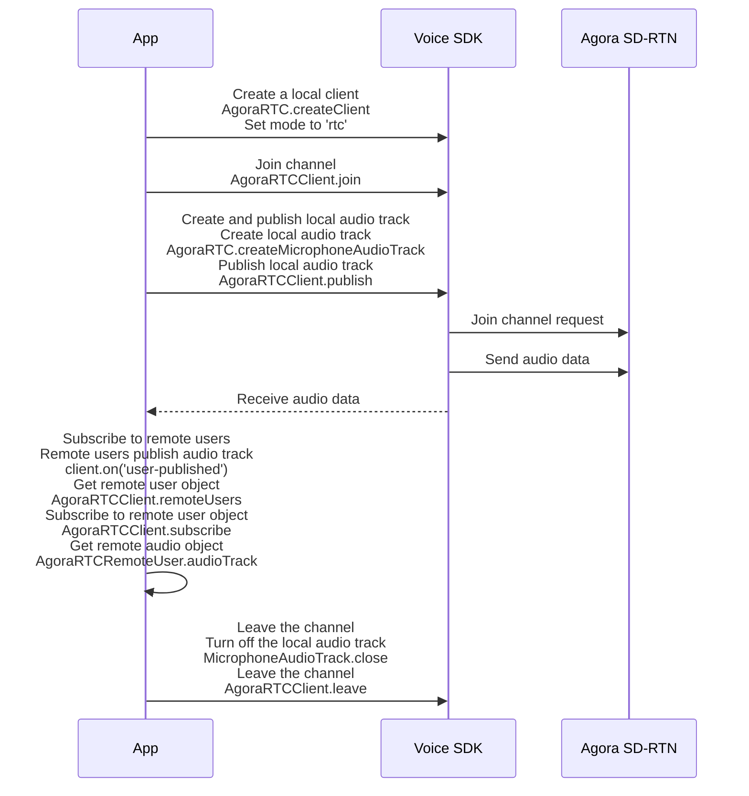

# Sequence Diagram

```mermaid
sequenceDiagram
    participant App
    participant Voice_SDK as Voice SDK
    participant Agora_SD_RTN as Agora SD-RTN
    
    App->>Voice_SDK: Create a local client<br/>AgoraRTC.createClient<br/>Set mode to 'rtc'
    App->>Voice_SDK: Join channel<br/>AgoraRTCClient.join
    App->>Voice_SDK: Create and publish local audio track<br/>Create local audio track<br/>AgoraRTC.createMicrophoneAudioTrack<br/>Publish local audio track<br/>AgoraRTCClient.publish
    Voice_SDK->>Agora_SD_RTN: Join channel request
    Voice_SDK->>Agora_SD_RTN: Send audio data

    Voice_SDK-->>App: Receive audio data
    App->>App: Subscribe to remote users<br/>Remote users publish audio track<br/>client.on('user-published')<br/>Get remote user object<br/>AgoraRTCClient.remoteUsers<br/>Subscribe to remote user object<br/>AgoraRTCClient.subscribe<br/>Get remote audio object<br/>AgoraRTCRemoteUser.audioTrack

    App->>Voice_SDK: Leave the channel<br/>Turn off the local audio track<br/>MicrophoneAudioTrack.close<br/>Leave the channel<br/>AgoraRTCClient.leave
```
