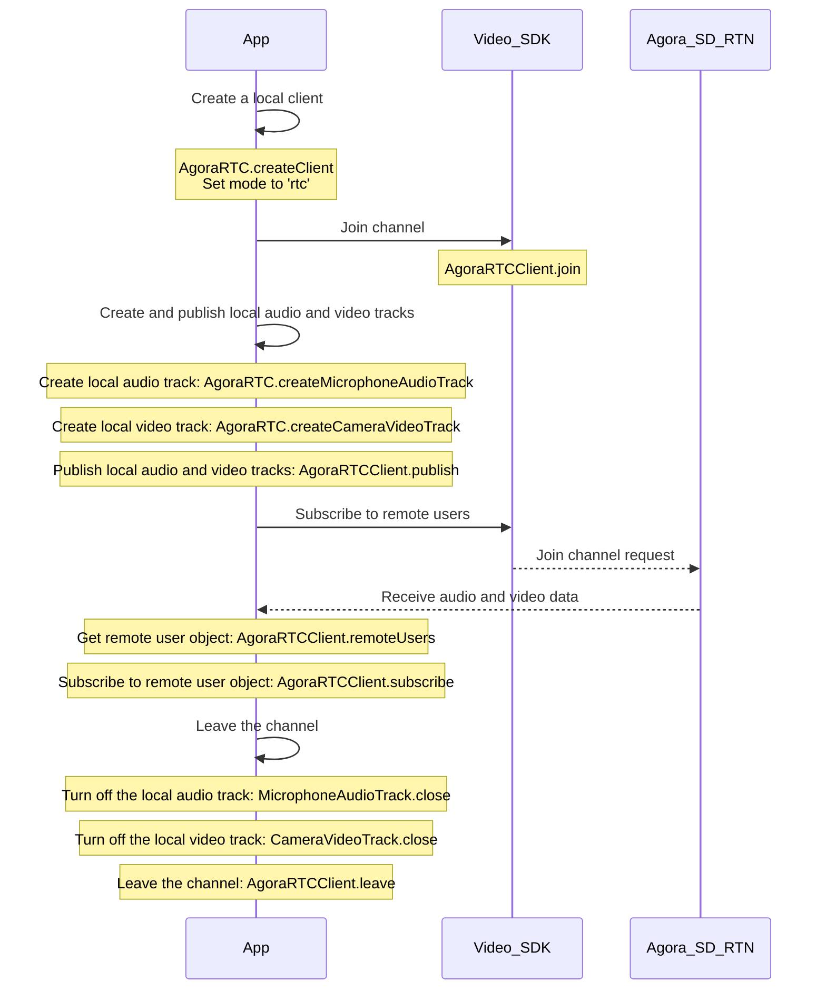

# Sequence Diagram

```mermaid
sequenceDiagram
    participant App
    participant Video_SDK
    participant Agora_SD_RTN

    App->>App: Create a local client
    Note over App : AgoraRTC.createClient<br/>Set mode to 'rtc'

    App->>Video_SDK: Join channel
    Note over Video_SDK : AgoraRTCClient.join

    App->>App: Create and publish local audio and video tracks
    Note over App : Create local audio track: AgoraRTC.createMicrophoneAudioTrack
    Note over App : Create local video track: AgoraRTC.createCameraVideoTrack
    Note over App : Publish local audio and video tracks: AgoraRTCClient.publish

    App->>Video_SDK: Subscribe to remote users
    Video_SDK-->>Agora_SD_RTN: Join channel request
    Agora_SD_RTN-->>App: Receive audio and video data
    Note over App : Get remote user object: AgoraRTCClient.remoteUsers
    Note over App : Subscribe to remote user object: AgoraRTCClient.subscribe

    App->>App: Leave the channel
    Note over App : Turn off the local audio track: MicrophoneAudioTrack.close
    Note over App : Turn off the local video track: CameraVideoTrack.close
    Note over App : Leave the channel: AgoraRTCClient.leave
```
