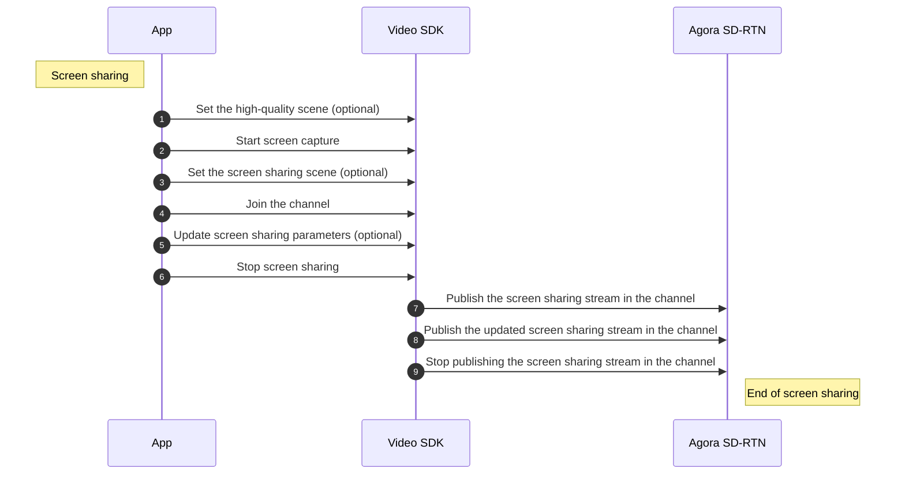

# Sequence Diagram

```mermaid
sequenceDiagram
autonumber
participant ComApp as App
participant ComSDK as Video SDK
participant CloudAgora as Agora SD-RTN

note left of ComApp: Screen sharing

ComApp->>ComSDK: Set the high-quality scene (optional)
ComApp->>ComSDK: Start screen capture
ComApp->>ComSDK: Set the screen sharing scene (optional)
ComApp->>ComSDK: Join the channel
ComApp->>ComSDK: Update screen sharing parameters (optional)
ComApp->>ComSDK: Stop screen sharing

ComSDK->>CloudAgora: Publish the screen sharing stream in the channel
ComSDK->>CloudAgora: Publish the updated screen sharing stream in the channel
ComSDK->>CloudAgora: Stop publishing the screen sharing stream in the channel

note right of CloudAgora: End of screen sharing
```
